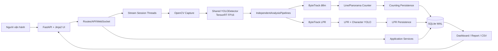
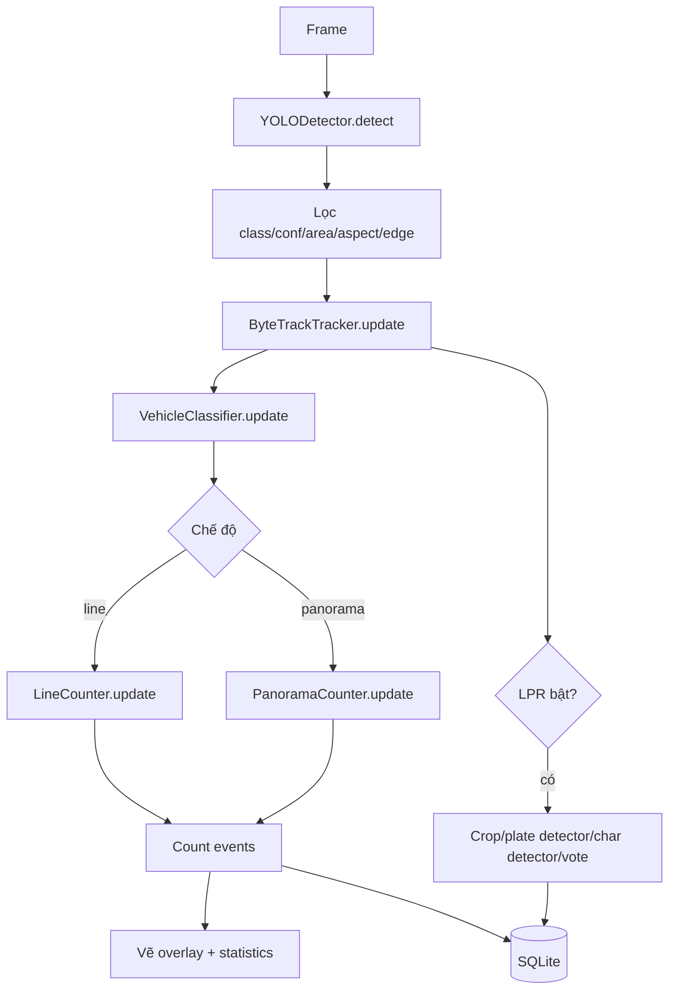
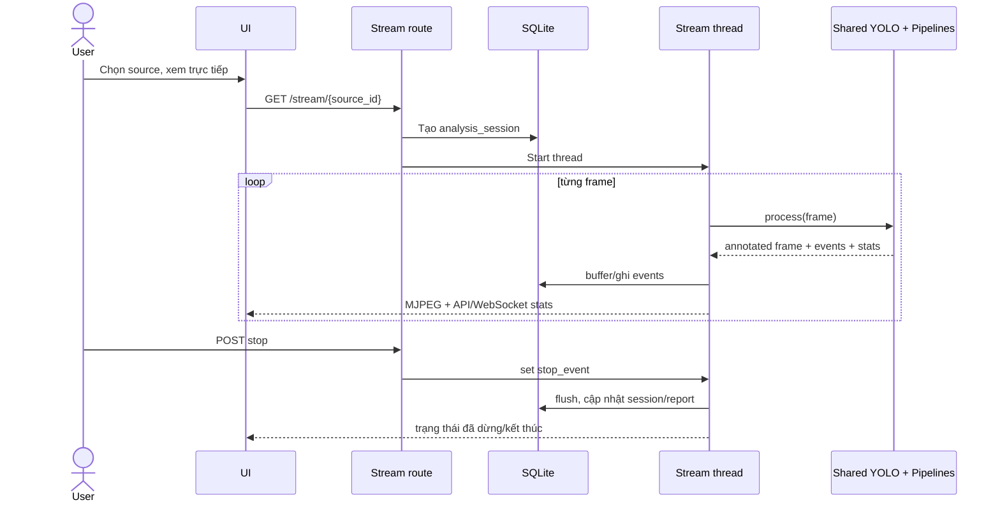
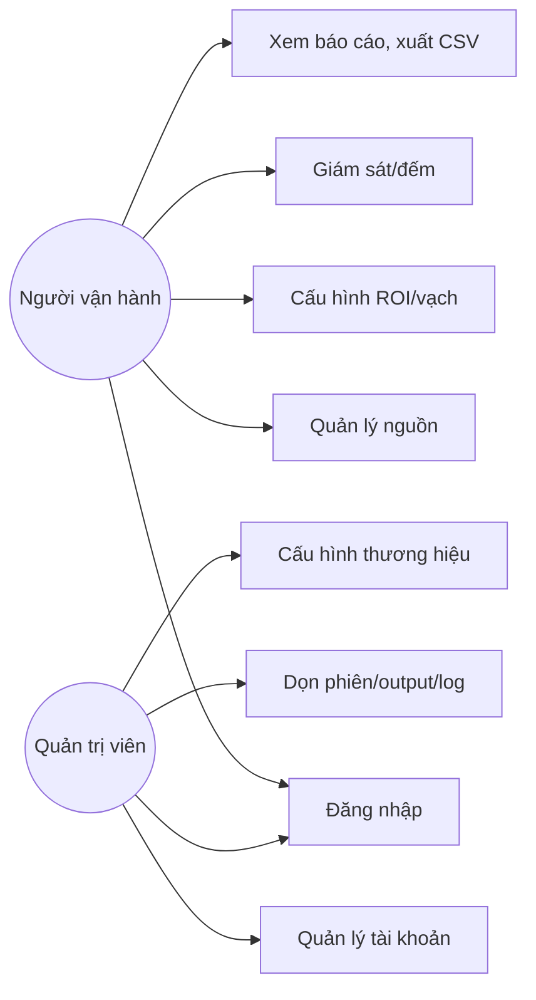
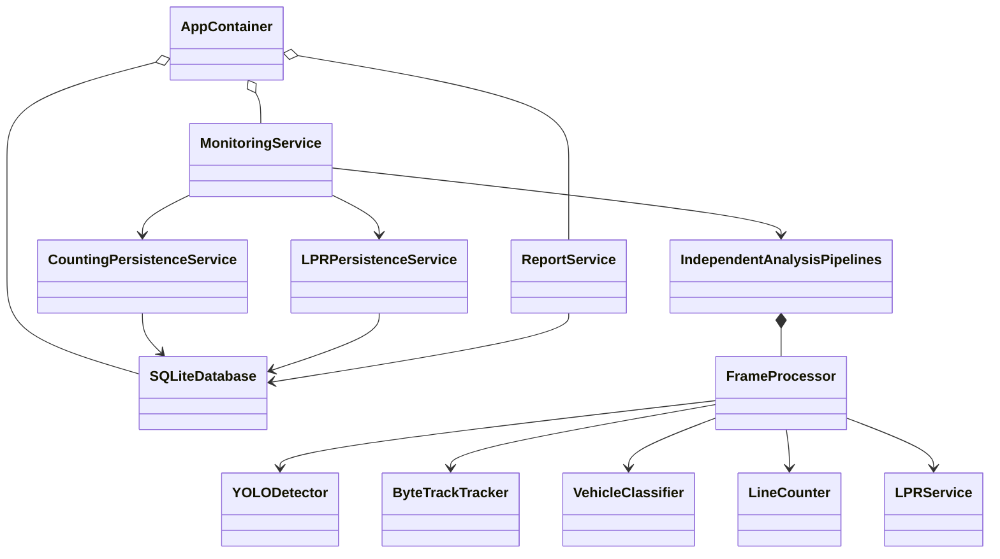

# BÁO CÁO KHẢO SÁT DỰ ÁN PHỤC VỤ ĐỒ ÁN TỐT NGHIỆP

**Tên đề tài:** *Xây dựng hệ thống giám sát và phân loại phương tiện giao thông thời gian thực dựa trên camera tại các nút giao Hà Nội*  
**Ngày kiểm kê mã nguồn:** 22/07/2026  
**Phạm vi kiểm kê:** mã nguồn, cấu hình, model, dataset, SQLite, giao diện, video mẫu, output và log hiện có trong repository. Không sửa/chạy huấn luyện, không cài package và không tạo dữ liệu thử mới.  
**Quy ước:** số liệu ghi “tính từ checkpoint” là dữ liệu nhúng trong checkpoint; “tính suy ra” là phép tính trực tiếp từ số liệu đó, không phải metric do framework lưu. Mọi nội dung không có chứng cứ được ghi **CHƯA XÁC MINH – CẦN SINH VIÊN CUNG CẤP**.

---

# PHẦN A. TỔNG QUAN NHANH VỀ DỰ ÁN

## 1. Tóm tắt hệ thống

Hệ thống giải bài toán nhận diện, theo dõi, phân loại và đếm phương tiện đi qua một vạch ảo/ROI trên video giao thông; kết quả được hiển thị trên web, lưu theo phiên và tổng hợp thành báo cáo. Ngoài bài toán chính, project còn có nhánh nhận diện biển số Việt Nam. Bằng chứng: `vehicle_counting_system/core/frame_processor.py` → `FrameProcessor._run_inference()`; `vehicle_counting_system/counters/line_counter.py` → `LineCounter.update()`; `vehicle_counting_system/application/services/report_service.py` → `ReportService.list_reports()`.

- **Đầu vào:** file video và luồng mạng RTSP/HTTP/HTTPS/RTMP trên web; CLI còn nhận webcam qua chỉ số camera. Bằng chứng: `vehicle_counting_system/application/services/source_service.py` → `validate_source_paths()`; `vehicle_counting_system/presentation/web/routes/stream.py` → `_is_live_stream()`, `_open_capture()`; `vehicle_counting_system/main.py` → `parse_source()`.
- **Lớp phương tiện của model demo chính:** `bus`, `car`, `motorcycle`, `truck`. Bicycle có xuất hiện trong một file ánh xạ cũ nhưng không thuộc bốn class của model TensorRT hiện tại. Bằng chứng: `vehicle_counting_system/data/models/yolo11s.engine` → metadata `names`; `.env` → `ALLOWED_CLASSES`; `vehicle_counting_system/configs/classes.py` → ánh xạ lớp.
- **Chức năng chính:** quản lý nguồn; tải video/thêm stream; vẽ ROI, vạch đếm và vùng LPR; nhận diện YOLO; ByteTrack; làm ổn định class; đếm hai hướng; xem MJPEG trực tiếp; dashboard; lưu SQLite; báo cáo chi tiết và CSV; đăng nhập/phân quyền. Bằng chứng: `vehicle_counting_system/presentation/web/routes/api.py` → `build_router()`; `vehicle_counting_system/core/independent_pipelines.py` → `IndependentAnalysisPipelines`; `vehicle_counting_system/presentation/web/routes/reports.py` → `build_router()`.
- **Đầu ra:** frame/video có bounding box, ID và thống kê; tổng/per-class/per-direction; sự kiện đếm; ảnh xe/biển và chuỗi biển số khi LPR hoạt động; bản ghi phiên; dashboard; CSV chi tiết. Bằng chứng: `vehicle_counting_system/core/frame_processor.py` → `FrameProcessor.process()`; `vehicle_counting_system/infrastructure/persistence/sqlite_db.py` → `SQLiteDatabase.init_schema()`; `vehicle_counting_system/application/services/report_service.py` → `ReportService.get_detailed_vehicles_csv()`.
- **Dạng ứng dụng:** sản phẩm chính là web local dùng FastAPI + Jinja2; đồng thời còn giao diện cửa sổ OpenCV/console kiểu legacy. Các file `ui/*.py` chỉ là scaffold, không phải WinForms/WPF/PyQt hoàn chỉnh. Bằng chứng: `vehicle_counting_system/presentation/web/app.py` → `create_app()`; `vehicle_counting_system/core/pipeline.py` → `Pipeline._open_window()`; `vehicle_counting_system/ui/`.
- **Môi trường hiện tại:** local Windows trên laptop NVIDIA; model phương tiện chạy TensorRT FP16/CUDA. Không có cấu hình triển khai cloud/edge production được xác minh. Bằng chứng: `.env` → `DEVICE`, `USE_GPU`, `YOLO_PRECISION`; `vehicle_counting_system/data/models/yolo11s.engine` → metadata TensorRT/FP16; `.venv/pyvenv.cfg` → Python 3.10.
- **Người dùng mục tiêu suy ra từ chức năng:** người vận hành giám sát giao thông và quản trị hệ thống; project có role `admin` và `user`. Đây là vai trò phần mềm, chưa có tài liệu xác nhận đơn vị nghiệp vụ thực tế. Bằng chứng: `vehicle_counting_system/application/services/auth_service.py` → `AuthService`; `vehicle_counting_system/presentation/web/templates/users.html`. **Đơn vị sử dụng thực tế: CHƯA XÁC MINH – CẦN SINH VIÊN CUNG CẤP.**

**Mức hoàn thiện tổng thể:** prototype tích hợp khá đầy đủ cho demo **một nguồn** và bài toán đếm xe, nhưng chưa đủ chứng cứ để gọi là hệ thống thời gian thực đa nút giao đã được kiểm định. Detector chính chạy được và DB có dữ liệu thực; ngược lại LPR có lỗi runtime nghiêm trọng, đa kênh có lỗi chia sẻ trạng thái ghi DB, dữ liệu huấn luyện tương ứng với model cuối thiếu khỏi repository, và chưa có benchmark FPS/sai số đếm. Bằng chứng: `vehicle_counting_system/data/outputs/logs/vehicle_counting.log`; `vehicle_counting_system/core/frame_processor.py` → `FrameProcessor._process_lpr_for_vehicle()`; `vehicle_counting_system/application/bootstrap.py` → `build_container()`.

## 2. Phạm vi thực tế của đề tài

### 2.1. Phân loại phạm vi

| Nhóm | Nội dung thực tế | Kết luận | Bằng chứng |
|---|---|---|---|
| Đúng tên đề tài | Đọc camera/video, phát hiện bốn nhóm phương tiện, gán ID, đếm qua vạch, hiển thị gần thời gian thực | Cốt lõi, phải giữ | `core/frame_processor.py` → `FrameProcessor._run_inference()`; `counters/line_counter.py` → `LineCounter.update()` |
| Đúng tên đề tài nhưng chưa chứng minh đầy đủ | Nhiều camera/nút giao Hà Nội, hiệu năng thời gian thực, độ chính xác đếm | Có code hỗ trợ một phần, thiếu benchmark/ground truth | `presentation/web/routes/stream.py` → `_ensure_stream()`; `data/inputs/videos/TP-Ngã_4_...mp4` |
| Vượt phạm vi | Nhận diện biển số/OCR, quản trị thương hiệu, tài khoản, log quản trị | Chức năng mở rộng | `ai_core/services/lpr_service.py` → `LPRService`; `presentation/web/routes/brand_settings.py` → `build_router()` |
| Phụ trợ hữu ích | Dashboard, báo cáo, CSV, upload, ROI editor, đăng nhập | Giữ nếu không gây rủi ro demo | `presentation/web/routes/dashboard.py`; `presentation/web/routes/reports.py`; `presentation/web/templates/edit_roi.html` |
| Đang làm dở | LPR, đa luồng ghi DB, AI configuration, queue headless tuần tự | Không đưa thành tuyên bố cốt lõi đã hoàn thiện | `core/frame_processor.py`; `application/services/monitoring_service.py` → `queue_session()` |
| Chưa hoạt động đúng | Pause/resume; LPR thường xuyên ném `TypeError`; output mặc định `result.mp4` đang là thư mục | Không demo trước khi sửa và kiểm thử | `core/pipeline.py` → `ProcessingState.paused` (“reserved for future UI”); `data/outputs/logs/vehicle_counting.log`; `data/outputs/videos/result.mp4/` |
| Nên hoãn | LPR, đa kênh đồng thời, RTSP ngoài mạng kiểm soát, cloud tunnel, phát hiện vi phạm/GIS | Chuyển sang hướng phát triển | `presentation/web/routes/stream.py`; `cloudflared.exe`; không có module vi phạm/GIS |

### 2.2. MVP bảo vệ đồ án

**MVP bảo vệ đồ án đề xuất:** web local, đăng nhập, chọn **một file video mẫu đã khóa**, vẽ/nạp ROI và vạch đếm, dùng `yolo11s.engine` nhận diện bốn class, ByteTrack gán ID, đếm hai chiều, hiển thị thống kê, lưu sự kiện vào SQLite, mở báo cáo và xuất CSV. Tắt LPR và không tuyên bố đa kênh trong phần kết quả chính. Bằng chứng nền tảng: `.env` → `ENABLE_COUNTING_PIPELINE`, `ENABLE_LPR_PIPELINE`; `presentation/web/templates/monitoring.html`; `application/services/report_service.py` → `get_detailed_vehicles_csv()`.

Trước demo phải xử lý thư mục sai tên `vehicle_counting_system/data/outputs/videos/result.mp4/`, khóa cấu hình/model/video, kiểm tra tài khoản và chạy một kịch bản có ground truth thủ công. Đây là đề xuất xử lý, không phải trạng thái đã hoàn thành. Bằng chứng: `vehicle_counting_system/core/pipeline.py` → `Pipeline._open_writer()`; `RUN_WEB.md`.

---

# PHẦN B. THÔNG TIN PHỤC VỤ CHƯƠNG 1 – MỞ ĐẦU

## 3. Bài toán và tính cấp thiết

### 3.1. Tính cấp thiết của đề tài

Sản phẩm hướng tới tự động hóa việc quan sát luồng phương tiện tại điểm đặt camera: thay vì người xem video và ghi tay, hệ thống phát hiện từng xe, duy trì ID và tạo sự kiện khi xe cắt vạch. Dữ liệu theo lớp, hướng và thời điểm có thể dùng cho thống kê lưu lượng, đánh giá cơ cấu phương tiện và hỗ trợ vận hành. Bằng chứng: `vehicle_counting_system/counters/line_counter.py` → `LineCounter.update()`; `vehicle_counting_system/infrastructure/persistence/sqlite_db.py` → bảng `vehicle_counts`.

Quan sát thủ công khó mở rộng cho video dài/nhiều camera, thiếu nhất quán và không tạo được dữ liệu tức thời. Ý nghĩa “thời gian thực” của sản phẩm là xử lý frame liên tục, hiển thị MJPEG và cập nhật WebSocket/API, không phải một mức FPS đã được chứng nhận. Bằng chứng: `vehicle_counting_system/presentation/web/routes/stream.py` → `_process_live_stream()`; `vehicle_counting_system/presentation/web/routes/ws_monitoring.py` → `build_router()`. **FPS thời gian thực đạt được: CHƯA XÁC MINH – CẦN SINH VIÊN CUNG CẤP.**

Camera giao thông tạo nguồn quan sát không tiếp xúc, có thể tái sử dụng cho nhận diện, tracking, đếm và lưu bằng chứng. Repository có một video mang tên nút giao “Minh Khai - Lê Lợi” và cấu hình nhiều source, nhưng tên file không đủ chứng minh địa điểm, quyền sử dụng hay tính đại diện cho toàn Hà Nội. Bằng chứng: `vehicle_counting_system/data/inputs/videos/TP-Ngã_4_Minh_Khai_-_Lê_Lợi--(GD2)_20260604_082703-083232.mp4`; `vehicle_counting_system/configs/sources/`. **Nguồn gốc camera, địa điểm chính xác và giấy phép dữ liệu: CHƯA XÁC MINH – CẦN SINH VIÊN CUNG CẤP.**

Không có tài liệu trong project chứa số liệu ùn tắc, tai nạn hoặc lưu lượng Hà Nội; báo cáo Chương 1 chỉ nên bổ sung các số liệu này khi có nguồn trích dẫn độc lập do sinh viên cung cấp.

### 3.2. Mục tiêu nghiên cứu

- **Mục tiêu tổng quát:** xây dựng prototype phần mềm thị giác máy tính nhận diện, phân loại, theo dõi và thống kê phương tiện từ camera/video tại nút giao. Bằng chứng: `vehicle_counting_system/core/independent_pipelines.py` → `IndependentAnalysisPipelines.process()`.
- **Mục tiêu cụ thể đã thể hiện trong code:** nhận bốn lớp; lọc detection; gán ID; cấu hình ROI/vạch; đếm hai hướng, chống trùng trong một chu kỳ track; hiển thị web; lưu phiên/sự kiện; xuất CSV. Bằng chứng: `detectors/yolo_detector.py` → `YOLODetector.detect()`; `trackers/bytetrack_tracker.py` → `ByteTrackTracker.update()`; `application/services/report_service.py` → `get_detailed_vehicles_csv()`.
- **Chỉ tiêu kỹ thuật hiện có dạng cấu hình:** confidence 0,25; ảnh inference 960; tối đa 100 detection; giới hạn stream 12 FPS; output rộng 1280; bốn class. Đây là tham số vận hành, **không phải kết quả benchmark**. Bằng chứng: `.env` → `CONF_THRESHOLD`, `IMAGE_SIZE`, `MAX_DETECTIONS`, `STREAM_MAX_FPS`, `STREAM_OUTPUT_WIDTH`.
- **Kết quả đầu ra cần đạt:** video/frame chú thích, số lượng theo class/hướng, lịch sử phiên, dashboard, CSV; với mở rộng LPR là chuỗi/ảnh biển số. Bằng chứng: `services/export_service.py` → `ExportService.export_summary_csv()`; `infrastructure/persistence/sqlite_db.py` → `init_schema()`.

### 3.3. Đối tượng và phạm vi nghiên cứu

- **Đối tượng nghiên cứu:** chuỗi xử lý video bằng object detection + multi-object tracking + line-crossing counting trong phần mềm web. Bằng chứng: `core/frame_processor.py` → `FrameProcessor`; `counters/line_counter.py` → `LineCounter`.
- **Đối tượng nhận diện:** bus, car, motorcycle, truck. Bằng chứng: model `vehicle_counting_system/data/models/yolo11s.engine` → metadata `names`.
- **Nguồn dữ liệu:** video cục bộ, stream mạng; CLI có webcam. Bằng chứng: `application/services/source_service.py` → `validate_source_paths()`; `main.py`.
- **Không gian:** một vùng ROI/vạch theo từng source; mục tiêu tên đề tài là các nút giao Hà Nội nhưng chỉ có dấu vết tên một video, chưa đủ xác minh phạm vi địa lý. Bằng chứng: `application/services/source_config_service.py` → `save_source_config()`.
- **Thời gian:** frame liên tục trong một phiên; DB có phiên từ 13/07/2026 đến 20/07/2026, nhưng chưa có thử nghiệm theo ngày/đêm/mùa. Bằng chứng: `data/outputs/app/traffic_monitoring.db` → bảng `analysis_sessions`.
- **Phạm vi chức năng chính:** nhận diện, tracking, phân loại, đếm, hiển thị, lưu, báo cáo. Nhận diện biển số và quản trị là mở rộng. Không có module phát hiện vi phạm, điều khiển đèn, dự báo, GIS hay phân tích tốc độ được xác minh.

### 3.4. Nội dung thực hiện thực tế

1. Tổ chức dữ liệu YOLO cho biển số/ký tự và viết script gộp dataset ký tự. Bằng chứng: `merge_char_datasets.py` → `merge_datasets()`; `data/char_dataset_merged/data.yaml`.
2. Fine-tune các model nhận diện xe, biển số, ký tự; xuất model xe sang TensorRT. Chỉ checkpoint còn giữ được train args/results, còn script và dataset tương ứng không đầy đủ. Bằng chứng: `vehicle_counting_system/data/models/yolo11s.pt`; `license_plate_detector_yolo11.pt`; `char_detector_yolo11.pt` → metadata checkpoint.
3. Xây detector, tracker ByteTrack/Re-ID, bộ ổn định class, bộ đếm qua vạch/panorama. Bằng chứng: `detectors/yolo_detector.py`; `trackers/bytetrack_tracker.py`; `classifiers/vehicle_classifier.py`; `counters/`.
4. Xây pipeline video CLI và runner headless. Bằng chứng: `core/pipeline.py` → `Pipeline.run()`; `ai_core/services/video_analysis_runner.py` → `analyze_video_source()`.
5. Xây web FastAPI, quản lý nguồn/ROI, giám sát đơn/đa luồng, dashboard, user/admin. Bằng chứng: `presentation/web/app.py` → `create_app()`; `presentation/web/routes/`.
6. Tích hợp SQLite, sự kiện đếm/LPR, báo cáo CSV. Bằng chứng: `application/bootstrap.py` → `build_container()`; `application/services/counting_persistence_service.py` → `CountingPersistenceService.record()`.
7. Thêm kiểm thử đơn vị/hardening và log vận hành. Chưa chạy lại test trong lần kiểm kê để không phát sinh file ngoài báo cáo. Bằng chứng: `vehicle_counting_system/tests/`; `data/outputs/logs/vehicle_counting.log`.

### 3.5. Phương pháp thực hiện có bằng chứng

| Phương pháp | Có/không | Bằng chứng và giới hạn |
|---|---|---|
| Khảo sát/phân tích yêu cầu | Có một phần | Entity/service/route và UI thể hiện yêu cầu; không thấy đặc tả yêu cầu riêng. Bằng chứng: `domain/models/entities.py`; `presentation/web/routes/` |
| Thu thập/gán nhãn dữ liệu | Có dữ liệu YOLO từ Roboflow; tự thu thập chưa xác minh | `data/*/README.roboflow.txt`; nhãn `.txt` |
| Xử lý/gộp dữ liệu | Có | `merge_char_datasets.py` → `merge_datasets()` |
| Huấn luyện/fine-tune | Có chứng cứ checkpoint | ba file `.pt` hiện hành → `train_args`, `train_results` |
| Nhận diện đối tượng | Có | `detectors/yolo_detector.py` → `YOLODetector.detect()` |
| Theo dõi đối tượng | Có | `trackers/bytetrack_tracker.py` → `ByteTrackTracker.update()` |
| Đếm/phân loại | Có | `counters/line_counter.py`; `classifiers/vehicle_classifier.py` |
| Thiết kế phần mềm phân tầng | Có | `application/bootstrap.py`; `presentation/web`; `infrastructure/persistence` |
| Kiểm thử/đánh giá | Có test code và log, chưa có bộ benchmark ground truth | `vehicle_counting_system/tests/`; `data/outputs/logs/vehicle_counting.log` |

---

# PHẦN C. THÔNG TIN PHỤC VỤ CHƯƠNG 2 – CƠ SỞ LÝ THUYẾT VÀ CÔNG NGHỆ

## 4. Cơ sở lý thuyết

| Nội dung cần trình bày | Cách áp dụng thật trong project | Bằng chứng |
|---|---|---|
| Computer Vision | Đọc frame, xử lý ảnh, detection, vẽ kết quả | `core/frame_processor.py` → `FrameProcessor.process()` |
| Object Detection | YOLO11 dự đoán bbox/class/confidence cho xe, biển và ký tự | `detectors/yolo_detector.py` → `YOLODetector.detect()`; `ai_core/services/lpr_service.py` → `LPRService._init_models()` |
| Phân loại đối tượng | Class là đầu ra detector rồi được vote theo lịch sử track, không có classifier CNN độc lập | `classifiers/vehicle_classifier.py` → `VehicleClassifier.update()` |
| Bounding Box | Dùng `xyxy` để lọc, track, crop và vẽ | `detectors/yolo_detector.py` → `detect()`; `core/frame_processor.py` |
| Confidence Score | Threshold detector, lọc count, LPR và OCR | `.env` → `CONF_THRESHOLD`; `counters/line_counter.py` → `min_count_confidence`; `ai_core/services/yolo_char_recognizer.py` |
| IoU | NMS của YOLO, ByteTrack matching và lọc ký tự trùng | `detectors/yolo_detector.py` → `model.predict(iou=...)`; `trackers/bytetrack_tracker.py`; `ai_core/services/yolo_char_recognizer.py` |
| Non-Maximum Suppression | Ultralytics nhận `iou=0.45`; code không tự cài NMS cho detector xe | `configs/settings.py` → `nms_iou_threshold`; `detectors/yolo_detector.py` → `detect()` |
| Tracking/gán ID | Supervision ByteTrack tạo ID; lớp wrapper ánh xạ sang `stable_id/display_id` và Re-ID ngắn hạn | `trackers/bytetrack_tracker.py` → `ByteTrackTracker.update()` |
| Đếm phương tiện | Kiểm tra đổi phía và giao cắt đoạn hữu hạn, ghi theo stable ID/direction | `counters/line_counter.py` → `LineCounter.update()` |
| ROI/vạch đếm | Tọa độ normalized theo source, scale theo frame | `application/services/source_config_service.py` → `save_source_config()`; `core/frame_processor.py` → load cấu hình |
| Video thời gian thực | Capture liên tục; RTSP reader giữ frame mới nhất; stream JPEG MJPEG | `presentation/web/routes/stream.py` → `_rtsp_reader_thread()`, `_process_live_stream()` |
| Metric | Precision, Recall, mAP50, mAP50-95, box/cls/dfl loss có trong checkpoint | các model `.pt` → `train_results` |

Nên giải thích rõ trong luận văn: detection tạo quan sát ở từng frame; tracking liên kết các quan sát qua thời gian; counting là luật sự kiện dựa trên track. Ba khái niệm này không đồng nghĩa và metric detection không chứng minh sai số đếm.

## 5. Mô hình AI đang sử dụng

### 5.1. Phân biệt các thành phần

| Thành phần | Loại/biến thể | File chương trình ưu tiên | Trạng thái |
|---|---|---|---|
| Detector phương tiện | Ultralytics YOLO11s, detect, 4 class, TensorRT static batch 1, 960×960, FP16 | `vehicle_counting_system/data/models/yolo11s.engine` | **Model demo chính**; bắt buộc `.engine` theo settings |
| Checkpoint nguồn xe | YOLO11s `.pt`, fine-tune 4 class | `vehicle_counting_system/data/models/yolo11s.pt` | Nhiều khả năng là nguồn export engine; chương trình chính không cho dùng `.pt` |
| Tracker | Supervision ByteTrack + wrapper Re-ID | Không phải model trọng số | Đang dùng sau detector |
| Detector biển số | YOLO11s, 1 class `License_Plate` | `license_plate_detector_yolo11.pt` | Đang fallback sang PT vì file `.engine` hoạt động không tồn tại |
| OCR ký tự | YOLO11s detect, 31 class ký tự | `char_detector_yolo11.pt` | Đang fallback sang PT; không phải OCR Tesseract |
| Model cũ/không dùng chính | `yolo11m.engine`, `yolo11s_fp16.engine`, `yolo11s_fp32.engine` COCO 80 class; các `.pt` ở root; `.engine.old/.bak` LPR | Nhiều vị trí | Không được settings/demo chính trỏ tới |

Bằng chứng: `configs/settings.py` → `Settings.validate()`/`yolo_weights`; `ai_core/services/lpr_service.py` → `LPRService._init_models()`; metadata nhúng trong các file model; `trackers/bytetrack_tracker.py` → `ByteTrackTracker`.

### 5.2. Nguồn gốc và cách nạp

Model xe là YOLO11s pretrained rồi fine-tune trên dataset custom bốn lớp; checkpoint ghi đường dẫn `data/vehicle_dataset_2/data.yaml`. Model LPR và ký tự cũng là fine-tune, lần lượt trỏ tới `data/lpr_dataset_v3/data.yaml` và `data/char_dataset_v3/data.yaml`. Cả ba dataset này hiện **không có trong repository**. Bằng chứng: ba checkpoint `.pt` → `train_args.data`; `vehicle_counting_system/data/models/yolo11s.engine` → metadata `description`.

COCO chỉ liên quan trọng số pretrained/những engine 80 class cũ; không có chứng cứ ảnh COCO được đưa trực tiếp vào quá trình train custom. Không được mô tả “dataset của đề tài là COCO”. Bằng chứng: checkpoint → `train_args.pretrained=True`; engine chính → bốn `names` custom.

Đường nạp model xe: `.env:YOLO_WEIGHTS` → `configs/settings.py:settings.yolo_weights` → `detectors/yolo_detector.py:YOLODetector.__init__()` → `ultralytics.YOLO`. Web warm-up singleton qua `ai_core/services/video_analysis_runner.py:_get_shared_yolo_detector()` tại startup. Bằng chứng: `presentation/web/app.py` → `startup_event()`.

## 6. Dataset

### 6.1. Dataset tương ứng model cuối

| Model | Dataset được checkpoint ghi | Có trong repo? | Kết luận |
|---|---|---|---|
| Xe `yolo11s.pt/.engine` | `data/vehicle_dataset_2/data.yaml` | Không | Không thể kiểm kê ảnh/split/class instance hoặc tái lập train |
| Biển `license_plate_detector_yolo11.pt` | `data/lpr_dataset_v3/data.yaml` | Không | Không thể đối chiếu với dataset biển còn lại |
| Ký tự `char_detector_yolo11.pt` | `data/char_dataset_v3/data.yaml` | Không | Không thể đối chiếu chính xác 31 class với dataset merged 36 class |

Bằng chứng: metadata `train_args.data` trong từng checkpoint và kết quả tìm file toàn repository. Với ba dataset trên, số ảnh, nguồn, split, giấy phép, độ phân giải, phân bố class và bối cảnh Hà Nội đều **CHƯA XÁC MINH – CẦN SINH VIÊN CUNG CẤP**.

### 6.2. Dataset thực sự còn trong repository

| Thư mục | Nguồn/giấy phép ghi trong file | Bài toán, class | Train/Val/Test ảnh | Số instance |
|---|---|---|---:|---:|
| `data/lpr_dataset` | Roboflow “Vietnamese License Plate” v1, CC BY 4.0 | detect biển, 1 class | 704/200/101 = 1.005 | 705/200/101 = 1.006 |
| `data/char_dataset` | Cùng metadata/dữ liệu với dataset trên | detect biển, 1 class | 704/200/101 = 1.005 | 705/200/101 = 1.006 |
| `data/char_dataset_210` | Roboflow “license-plate-characters-210” v4, CC BY 4.0 | ký tự, 36 class `0-9,A-Z` | 201/5/0 = 206 | 1.996 |
| `data/char_dataset_v1` | Roboflow “license-plate-characters” v1, CC BY 4.0 | ký tự, 35 class (thiếu `I`) | 1.044/83/38 = 1.165 | 7.935/664/304 = 8.903 |
| `data/char_dataset_merged` | Kết quả script gộp hai bộ ký tự | ký tự, 36 class `0-9,A-Z` | 1.245/88/38 = 1.371 | 9.887/708/304 = 10.899 |

Bằng chứng: `data/*/data.yaml`; `data/*/README.roboflow.txt`; kiểm kê file `images/labels`; `merge_char_datasets.py` → `merge_datasets()`.

Tất cả label là định dạng YOLO text: `class_id x_center y_center width height` chuẩn hóa, chia thư mục `train/valid/test/images|labels`. Bằng chứng: các file `data/*/*/labels/*.txt`; `data/*/data.yaml`.

Dataset biển 1.005 ảnh có ba kích thước chính: 640×410 (761 ảnh), 640×480 (185), 640×512 (59). Dataset ký tự merged có 1.165 ảnh 640×640; toàn bộ có 204 kích thước khác nhau, rộng 67–2.126 px và cao 31–640 px. Đây là thống kê file hiện hữu, không chứng minh kích thước đã đưa vào model cuối. Bằng chứng: metadata ảnh trong `data/lpr_dataset/*/images` và `data/char_dataset_merged/*/images`.

### 6.3. Mất cân bằng ký tự

Phân bố 10.899 instance của `char_dataset_merged` theo class là: `0:1684, 1:1466, 2:519, 3:454, 4:442, 5:410, 6:383, 7:432, 8:412, 9:432, A:1193, B:321, C:215, D:185, E:187, F:228, G:293, H:173, I:4, J:82, K:100, L:108, M:124, N:70, O:30, P:118, Q:60, R:76, S:123, T:216, U:80, V:94, W:29, X:50, Y:55, Z:51`. Các lớp `I`, `W`, `O` thiếu mẫu nghiêm trọng so với `0`, `1`, `A`. Bằng chứng: `data/char_dataset_merged/data.yaml` và tổng hợp các label trong `data/char_dataset_merged/*/labels`.

Augmentation của các dataset Roboflow chỉ được xác nhận ở mức dữ liệu export/README; augmentation lúc train model cuối nằm trong checkpoint (xem Mục 7). Bối cảnh nút giao Hà Nội, quy trình tự thu thập/gán nhãn, trùng ảnh giữa split và chất lượng annotation: **CHƯA XÁC MINH – CẦN SINH VIÊN CUNG CẤP**.

Thông tin “khoảng 118.000 ảnh”, “test khoảng 5.000 ảnh” không xuất hiện trong dataset/checkpoint/repository và mâu thuẫn với số file hiện hữu; phải coi là **CHƯA XÁC MINH – CẦN SINH VIÊN CUNG CẤP**, không phải kết quả của project hiện tại.

## 7. Thông số huấn luyện

### 7.1. Cấu hình và số epoch thực tế từ checkpoint

| Model | Dataset checkpoint | Epoch cấu hình/thực chạy | Batch / imgsz | Optimizer / LR | Patience | Device / workers / seed | Thời gian |
|---|---|---:|---|---|---:|---|---|
| Xe YOLO11s | `vehicle_dataset_2` (thiếu) | 30/30 | 16 / 640 | `auto`; `lr0=.01`, `lrf=.01` | 10 | `0` / 2 / 0 | 14.198,4 s ≈ 3,944 giờ |
| Biển YOLO11s | `lpr_dataset_v3` (thiếu) | 15 cấu hình/10 record | 16 / 640 | `auto`; LR do auto quyết định | 20 | `0` / 4 / 0 | log thời gian bị reset khi resume; không thể khẳng định tổng wall-time |
| Ký tự YOLO11s | `char_dataset_v3` (thiếu) | 35/35 | 32 / 320 | `auto`; `lr0=.01`, `lrf=.01` | 15 | `0` / 0 / 0 | 3.001,6 s ≈ 0,834 giờ |

Bằng chứng: `vehicle_counting_system/data/models/yolo11s.pt`, `license_plate_detector_yolo11.pt`, `char_detector_yolo11.pt` → `train_args`, `train_results.time`.

Cả ba checkpoint ghi `pretrained=True`. Augmentation model xe/ký tự gồm HSV (`hsv_h=.015`, `hsv_s=.7`, `hsv_v=.4`), translate `.1`, scale `.5`, horizontal flip `.5`, mosaic `1.0`, erasing `.4` và các mặc định Ultralytics khác; cần lấy nguyên bảng args từ checkpoint khi viết phụ lục, không suy từ script cũ. Bằng chứng: checkpoint → `train_args`.

Checkpoint tốt nhất/last đúng tên gốc không còn trong `runs`; file `.pt` hiện hành đã stripped (`epoch=-1`) nhưng chứa chuỗi `train_results`. Engine chính được export từ một checkpoint custom cùng kiến trúc/thời điểm gần `yolo11s.pt`, tuy nhiên quan hệ hash chính xác giữa hai file chưa được ghi. Bằng chứng: `vehicle_counting_system/data/models/`; metadata model. **File `best.pt` và `last.pt` nguyên gốc: CHƯA XÁC MINH – CẦN SINH VIÊN CUNG CẤP.**

`train_char_detector.py` cấu hình dataset merged, 80 epoch, batch 32, imgsz 320, patience 20; nó **không tái lập** checkpoint ký tự hiện hành (dataset v3, 35 epoch, patience 15). `merge_char_datasets.py` cũng chứa đường dẫn máy cá nhân. Bằng chứng: `train_char_detector.py` → `main()`; `merge_char_datasets.py`.

Thư mục `runs/` hiện không chứa artefact train. Không có bằng chứng huấn luyện 250 epoch; thông tin này chỉ có thể là kế hoạch và phải ghi **CHƯA XÁC MINH – CẦN SINH VIÊN CUNG CẤP**. Phần cứng huấn luyện không được lưu ngoài `device=0`; GPU RTX 3050 hiện tại chỉ là máy đang kiểm kê, không chắc là máy train.

## 8. Công nghệ và thư viện

| Nhóm | Công nghệ/phiên bản xác minh trên môi trường hiện tại | Vai trò | Bằng chứng |
|---|---|---|---|
| Ngôn ngữ/runtime | Python 3.10.0 | Toàn bộ backend/AI/CLI | `.venv/pyvenv.cfg`; runtime kiểm kê |
| Web | FastAPI 0.135.1, Starlette 0.52.1, Uvicorn 0.41.0 | API, session, routing, ASGI | package metadata trong `.venv`; `presentation/web/app.py` |
| Giao diện | Jinja2 3.1.6, HTML/CSS/JS | SSR template, dashboard/monitoring | `presentation/web/templates/`; `presentation/web/static/` |
| AI | Ultralytics 8.4.21; PyTorch 2.5.1+cu121 | Load/train/export YOLO, tensor/CUDA | package metadata; checkpoint/engine metadata |
| Ảnh/video | OpenCV 4.10.0 | VideoCapture/Writer, resize, crop, encode JPEG | `core/pipeline.py`; `presentation/web/routes/stream.py` |
| Tracking | Supervision 0.27.0.post1 | ByteTrack | `trackers/bytetrack_tracker.py` |
| Dữ liệu | NumPy 2.2.6, PyYAML 6.0.2, python-dotenv 1.2.2 | Array, cấu hình YAML/.env | `requirements.txt`; package metadata |
| Database | SQLite qua `sqlite3` chuẩn Python, WAL | Lưu user/source/session/count/LPR/report/log | `infrastructure/persistence/sqlite_db.py` → `connect()` |
| Báo cáo/biểu đồ | Python `csv`; Chart.js tải phía trình duyệt | CSV chi tiết và biểu đồ dashboard/report | `application/services/report_service.py`; `presentation/web/templates/reports.html` |
| GPU | CUDA 12.1 theo PyTorch, cuDNN 9.1; TensorRT 10.16.1.11 | Inference `.engine` FP16 | runtime package/GPU kiểm kê; `yolo11s.engine` metadata |
| Phần cứng hiện tại | NVIDIA GeForce RTX 3050 Laptop GPU, 4.096 MiB, driver 595.95 | Máy local demo | kết quả `nvidia-smi` ngày kiểm kê |
| Build/đóng gói | `pip` + `requirements.txt`; không có Docker/installer/package desktop | Khôi phục môi trường Python | `vehicle_counting_system/requirements.txt`; không có Dockerfile |

Các version trong `requirements.txt` chủ yếu là minimum hoặc không pin; bảng trên phản ánh venv hiện tại, không đảm bảo tái lập trên máy khác. TensorRT không được pin trong requirements. PyQt bị comment và UI PyQt không phải sản phẩm hiện hành. Bằng chứng: `vehicle_counting_system/requirements.txt`.

Visual Studio/.NET không tham gia project. Phiên bản VS Code không được lưu và không phải điều kiện runtime. **Phiên bản IDE đã phát triển: CHƯA XÁC MINH – CẦN SINH VIÊN CUNG CẤP.**

## 9. Các nghiên cứu hoặc giải pháp liên quan

Các giải pháp có chứng cứ trực tiếp chỉ gồm Ultralytics YOLO11, Supervision ByteTrack, OpenCV, FastAPI và hướng dẫn TensorRT của Ultralytics được comment trong requirements. Dataset công khai có metadata Roboflow. Không tìm thấy danh mục paper/repository học thuật mà project tuyên bố tham khảo; không được tự dựng phần tài liệu liên quan. Bằng chứng: `vehicle_counting_system/requirements.txt`; `data/*/README.roboflow.txt`.

- **Thành phần thư viện:** kiến trúc YOLO/inference Ultralytics, ByteTrack implementation của Supervision, OpenCV capture/codec, FastAPI/Starlette/Jinja2, SQLite. Bằng chứng: các import trong `detectors/yolo_detector.py`, `trackers/bytetrack_tracker.py`, `presentation/web/app.py`.
- **Thành phần project tự xây ở mức tích hợp/luật nghiệp vụ:** lọc bbox thích nghi, ánh xạ stable/display ID và Re-ID ngắn hạn, vote class theo track, finite-segment line crossing, spatial debounce, hai pipeline đếm/LPR, quản lý source/ROI/session, persistence, dashboard/report, OCR hậu xử lý biển Việt Nam. Bằng chứng: `detectors/yolo_detector.py`; `trackers/bytetrack_tracker.py`; `counters/line_counter.py`; `core/independent_pipelines.py`; `ai_core/services/yolo_char_recognizer.py`.
- **Khác với chỉ chạy YOLO:** hệ thống duy trì danh tính qua frame, xác định sự kiện qua vạch và hướng, chống đếm lặp, lưu dữ liệu theo phiên/nguồn, phục vụ UI và xuất báo cáo. Bằng chứng: `counters/line_counter.py` → `LineCounter.update()`; `application/services/counting_persistence_service.py` → `record()`.

Nguồn pretrained chính xác (checkpoint Ultralytics gốc nào), paper ByteTrack được sinh viên trích dẫn, quy trình cấp phép dữ liệu/video và repository tham khảo khác: **CHƯA XÁC MINH – CẦN SINH VIÊN CUNG CẤP.**

## 10. Giải pháp đề xuất

Giải pháp hiện tại đọc từng frame bằng OpenCV; detector YOLO11s TensorRT trả bbox/class/confidence; code lọc class, diện tích, tỉ lệ khung và vùng biên; ByteTrack liên kết detection và wrapper gán stable ID; VehicleClassifier vote class; LineCounter kiểm tra giao vạch/chiều; frame được vẽ và phát MJPEG/ghi video; sự kiện được buffer vào SQLite; dashboard/report truy vấn DB và xuất CSV. LPR là nhánh song song dùng crop xe → detector biển → crop/tiền xử lý → detector ký tự → định dạng/vote nhiều frame. Bằng chứng: `detectors/yolo_detector.py` → `detect()`; `core/frame_processor.py` → `_run_inference()`; `application/services/counting_persistence_service.py`; `application/services/report_service.py`.

**Pipeline cốt lõi:**  
`File video / webcam / RTSP-HTTP → OpenCV VideoCapture → lấy frame → YOLO11s TensorRT FP16 → lọc detection → ByteTrack + stable ID → ổn định class → ROI/vạch đếm → sự kiện theo lớp/hướng → vẽ frame/MJPEG hoặc video → SQLite → Dashboard/Báo cáo/CSV`

**Nhánh mở rộng LPR:**  
`Detection xe + track → crop xe → tăng sáng/CLAHE → YOLO11s detector biển → đánh giá chất lượng/crop biển → YOLO11s ký tự → sắp xếp 1–2 dòng → chuẩn hóa định dạng Việt Nam → vote nhiều crop → ảnh/sự kiện LPR trong SQLite`

Bằng chứng: `presentation/web/routes/stream.py` → `_process_video()`; `core/independent_pipelines.py` → `IndependentAnalysisPipelines`; `ai_core/services/lpr_service.py` → `LPRService`; `ai_core/services/yolo_char_recognizer.py` → `YOLOCharRecognizer.recognize()`.

---

# PHẦN D. THÔNG TIN PHỤC VỤ CHƯƠNG 3 – PHÂN TÍCH, THIẾT KẾ VÀ XÂY DỰNG

## 11. Cấu trúc mã nguồn

```text
doan/
├── product_web.py                 # ASGI entry, re-export app
├── web_main.py                    # chạy web local/mở trình duyệt
├── main.py                        # CLI wrapper
├── run_video.py                   # chạy video tiện ích
├── run_with_web_roi.py            # CLI dùng ROI đã lưu từ web
├── train_char_detector.py         # script train ký tự cũ, không khớp model hiện hành
├── merge_char_datasets.py         # gộp hai dataset ký tự
├── .env                           # cấu hình inference/runtime
├── RUN_WEB.md                     # hướng dẫn hiện có
├── data/
│   ├── lpr_dataset/               # dataset biển còn trong repo
│   ├── char_dataset*/             # các dataset biển/ký tự cũ và merged
│   └── ...                        # không có vehicle_dataset_2/lpr_dataset_v3/char_dataset_v3
└── vehicle_counting_system/
    ├── product_web.py             # tạo app FastAPI
    ├── main.py                    # entry CLI thật
    ├── ai_core/services/
    │   ├── video_analysis_runner.py
    │   ├── lpr_service.py
    │   └── yolo_char_recognizer.py
    ├── application/
    │   ├── bootstrap.py           # dependency container
    │   └── services/              # auth/source/monitoring/persistence/report
    ├── classifiers/
    │   └── vehicle_classifier.py
    ├── configs/
    │   ├── paths.py, settings.py, classes.py
    │   └── sources/source_*.json  # ROI/vạch/LPR zone theo nguồn
    ├── core/
    │   ├── pipeline.py
    │   ├── frame_processor.py
    │   └── independent_pipelines.py
    ├── counters/
    │   ├── line_counter.py
    │   └── panorama_counter.py
    ├── detectors/yolo_detector.py
    ├── trackers/bytetrack_tracker.py
    ├── infrastructure/persistence/sqlite_db.py
    ├── presentation/web/
    │   ├── app.py
    │   ├── routes/                # API/auth/dashboard/monitoring/stream/report/admin...
    │   ├── templates/             # Jinja2 HTML
    │   └── static/                # CSS/JS/logo/ảnh nền
    ├── services/                  # export/video writer
    ├── tests/                     # 40 test case được khai báo
    └── data/
        ├── inputs/videos/         # ba video mẫu
        ├── models/                # model xe/LPR/ký tự
        ├── output/                # output CLI legacy
        └── outputs/
            ├── app/traffic_monitoring.db
            ├── images/            # ảnh xe/biển/debug
            ├── logs/vehicle_counting.log
            ├── csv/
            └── videos/
```

Bằng chứng: kiểm kê file repository; `product_web.py`; `vehicle_counting_system/configs/paths.py` → các hằng đường dẫn. Thư mục `_backup_pipeline_split_20260720_1700/` là bản sao lưu mã, không phải runtime chính; `.venv`, cache, ảnh/label hàng nghìn file không được in trong cây.

## 12. Phân tích yêu cầu

### 12.1. Yêu cầu chức năng

| Chức năng | Mục đích | Đầu vào và quy trình | Đầu ra | Module | Trạng thái thực tế |
|---|---|---|---|---|---|
| Đăng nhập/phân quyền | Kiểm soát truy cập | Username/password → verify hash → session cookie/role | Phiên đăng nhập | `application/services/auth_service.py` → `authenticate()`; `routes/auth.py` | Có; tài khoản/mật khẩu demo hiện tại chưa được xác nhận độc lập |
| Quản lý nguồn | Thêm/xóa video hoặc URL stream | Upload/file path/URL → validate → SQLite | Source và file input | `application/services/source_service.py`; `routes/api.py` | Có; xóa source có thể xóa cả file video trong input |
| Cấu hình ROI/vạch/LPR zone | Định nghĩa vùng phân tích theo camera | Preview frame → người dùng vẽ → chuẩn hóa tọa độ → JSON | `source_<id>.json` | `application/services/source_config_service.py`; `templates/edit_roi.html` | Có, validation server-side |
| Phát hiện xe | Tìm bbox/class/confidence | Frame → TensorRT YOLO → lọc | Detection list | `detectors/yolo_detector.py` → `detect()` | Có, log xác nhận engine load/warm-up |
| Tracking/phân loại ổn định | Duy trì ID và giảm rung class | Detection → ByteTrack/Re-ID → vote class | Track ổn định | `trackers/bytetrack_tracker.py`; `classifiers/vehicle_classifier.py` | Có; chưa benchmark ID switch |
| Đếm qua vạch | Ghi xe cắt vạch theo chiều | Track anchors/history + đoạn đếm → debounce | Count event, tổng/per-class | `counters/line_counter.py` → `update()` | Có; DB có 1.214 sự kiện, chưa có ground truth |
| Đếm panorama | Đếm stable ID đủ số frame | Track quan sát ≥ `min_track_frames` | Tổng xe duy nhất trong phiên | `counters/panorama_counter.py` → `update()` | Có test unit; khác đếm qua vạch |
| Giám sát một luồng | Xem frame AI và số liệu | Source → stream session → MJPEG/stats | Video trực tiếp, statistics | `routes/stream.py` → `_ensure_stream()` | Có; LPR có thể làm luồng lỗi |
| Giám sát đa luồng | Hiển thị nhiều source | Nhiều source → thread riêng → detector dùng chung | Grid MJPEG | `routes/stream.py`; `templates/multi_monitoring.html` | Có code, nhưng persistence đồng thời không an toàn và chưa có số kênh test |
| Xử lý headless/queue | Phân tích file không cần MJPEG | Source/ROI → worker; queue FIFO | Video, session, summary | `application/services/monitoring_service.py` → `start_session()`, `queue_session()` | Chỉ một worker; queue tuần tự, không phải đa kênh |
| LPR | Lấy chuỗi biển số theo track | Crop xe → plate YOLO → char YOLO → format/vote | Text, confidence, ảnh | `ai_core/services/lpr_service.py`; `core/frame_processor.py` | **Chưa đạt:** lỗi `TypeError` tái diễn |
| Lưu dữ liệu | Giữ lịch sử theo phiên/source | Callback → buffer → SQLite WAL | 7 bảng dữ liệu | `counting_persistence_service.py`; `lpr_persistence_service.py` | Có; DB có orphan/schema drift |
| Dashboard/báo cáo/CSV | Tổng hợp và bàn giao kết quả | SQL → template/Chart.js/CSV | Thống kê, chart, CSV | `dashboard_service.py`; `report_service.py` | Có; chưa có CSV output hiện hữu, “peak hour” của snapshot bị đặt theo giờ kết thúc |
| Quản trị | User, logo, log, dọn dữ liệu | Form admin | Cấu hình/tài khoản/log | `routes/users.py`, `admin.py`, `brand_settings.py` | Có, không thuộc lõi AI |

### 12.2. Yêu cầu phi chức năng

| Tiêu chí | Trạng thái có bằng chứng | Khoảng trống |
|---|---|---|
| Độ chính xác detector | Có metric validation trong checkpoint, xem Mục 20 | Chưa test độc lập trên video bảo vệ; không có per-class |
| Độ chính xác tracking/đếm | Có logic và dữ liệu vận hành | **CHƯA XÁC MINH** MOTA/IDF1/ID switch/sai số đếm |
| FPS/độ trễ | Cấu hình cap stream 12 FPS, output 1280; không phải số đo | **CHƯA XÁC MINH** FPS thực, p50/p95 latency |
| CPU/GPU/VRAM/RAM | Máy có RTX 3050 4 GB; code có `psutil`, CUDA/TensorRT | **CHƯA XÁC MINH** mức sử dụng khi 1/2/3 nguồn |
| Nhiều video | Backend cho tối đa 3 stream; UI cho 16 ô | Chưa benchmark; có lỗi session persistence dùng chung |
| Phục hồi lỗi | Có `try/finally`, release capture/writer, recover stale session, reconnect RTSP | Log vẫn có lỗi disconnect, LPR TypeError và một lần lỗi bảng DB |
| Khả dụng | Web có ROI editor, status, dark/light, Việt/Anh, responsive navigation | Pause/resume không có; UI quảng bá đa luồng/LPR khi backend chưa ổn |
| Mở rộng | Có phân tầng service và detector singleton | Inference lock tuần tự, state global và hard-code làm hạn chế scale-out |
| Bảo trì | Có tests, type hints, container | requirements không pin; backup/code legacy/song song; data/model train thiếu |
| Bảo mật | Session, role, hash, CSRF form | JSON và `/api/` bỏ CSRF; URI RTSP có credential plaintext trong DB; foreign key tắt |

Bằng chứng: `.env`; `presentation/web/app.py` → `CSRFMiddleware`; `core/shutdown_manager.py`; `infrastructure/persistence/sqlite_db.py` → `connect()`, `recover_stale_sessions()`; `data/outputs/logs/vehicle_counting.log`.

## 13. Kiến trúc hệ thống

### 13.1. Kiến trúc tổng thể và tầng phần mềm

Project gần với kiến trúc phân tầng: Presentation (FastAPI/Jinja/routes), Application (service/container), Domain (entity), AI/Core (capture/detect/track/count/LPR), Infrastructure (SQLite), Services/Utils (export, writer, log). `AppContainer` khởi tạo singleton DB/service; route lấy container từ app state. Bằng chứng: `application/bootstrap.py` → `AppContainer`, `build_container()`; `presentation/web/dependencies.py` → `get_container()`.



Bằng chứng: `presentation/web/app.py` → `create_app()`; `core/independent_pipelines.py`; `application/bootstrap.py`.

### 13.2. Pipeline xử lý



Bằng chứng: `core/frame_processor.py` → `_run_inference()`; `counters/`; `ai_core/services/lpr_service.py`.

### 13.3. Trình tự một phiên giám sát web



Bằng chứng: `presentation/web/routes/stream.py` → `_ensure_stream()`, `_process_video()`, `_save_stream_results_to_db()`.

### 13.4. Use case rút gọn



Bằng chứng: `presentation/web/routes/auth.py`, `monitoring.py`, `reports.py`, `users.py`, `admin.py`, `brand_settings.py`.

### 13.5. Sơ đồ lớp rút gọn



Bằng chứng: constructor/import trong `application/bootstrap.py`, `core/independent_pipelines.py`, `core/frame_processor.py`.

### 13.6. Đồng thời và giải phóng tài nguyên

Mỗi `_StreamSession` có worker thread; RTSP thêm reader thread và buffer một frame mới nhất. Detector web là singleton và `YOLODetector` dùng lock nên inference giữa các kênh bị tuần tự hóa. LPR dùng `ThreadPoolExecutor(max_workers=1)` trong processor. Headless `MonitoringService` chỉ có một worker và một queue FIFO. Cơ chế này tránh block request/UI nhưng không bảo đảm scale tuyến tính. Bằng chứng: `presentation/web/routes/stream.py` → `_StreamSession`, `_rtsp_reader_thread()`; `detectors/yolo_detector.py` → `_inference_lock`; `core/frame_processor.py` → executor; `application/services/monitoring_service.py` → `_queue`.

Capture/writer/processor được release trong `finally`/cleanup; CLI còn destroy cửa sổ, clear CUDA cache và `gc.collect()`. Bằng chứng: `core/pipeline.py` → `cleanup_resources()`; `core/shutdown_manager.py` → `release_runtime_resources()`; `presentation/web/routes/stream.py` → `_process_video()`.

## 14. Xử lý đa kênh

| Câu hỏi | Kết quả kiểm kê | Bằng chứng |
|---|---|---|
| Tối đa theo backend | 3 stream đồng thời nếu không override env | `routes/stream.py` → `MAX_CONCURRENT_STREAMS` |
| Tối đa theo UI | Grid 1×1, 2×2, 3×3, 4×4 (tối đa 16 ô), không khớp backend | `templates/multi_monitoring.html` |
| Số kênh đã kiểm thử có kiểm soát | **CHƯA XÁC MINH – CẦN SINH VIÊN CUNG CẤP** | Log chỉ cho thấy nhiều source từng được start, không phải benchmark |
| Model | Một `YOLODetector` dùng chung toàn web | `ai_core/services/video_analysis_runner.py` → `_get_shared_yolo_detector()` |
| Batch inference | Không; mỗi frame gọi predict riêng | `detectors/yolo_detector.py` → `detect()` |
| Queue/bỏ frame | RTSP dùng buffer một slot, frame mới ghi đè frame chưa đọc; file video đọc tuần tự | `routes/stream.py` → `_LatestFrameBuffer`, `_process_live_stream()`, `_process_video_file()` |
| Đồng bộ camera | Không có timestamp synchronization giữa camera | Không có module/logic đồng bộ trong `routes/stream.py` |
| Tracker | Mỗi stream tạo `IndependentAnalysisPipelines`, mỗi nhánh có tracker riêng | `routes/stream.py` → `_process_video()`; `core/independent_pipelines.py` |
| Điểm nghẽn | Detector lock tuần tự; mỗi frame copy cho hai pipeline; hai tracker; LPR PT; encode JPEG; GPU 4 GB | `detectors/yolo_detector.py`; `core/independent_pipelines.py`; `routes/stream.py` |

**Lỗi kiến trúc đa kênh quan trọng:** `AppContainer` chỉ tạo **một** `CountingPersistenceService` và **một** `LPRPersistenceService`. Mỗi stream gọi `bind_session(session_id, source_id)`, ghi đè cặp ID dùng chung; một stream dừng còn có thể `unbind()` khiến stream khác mất binding. Vì vậy sự kiện đồng thời có nguy cơ bị gắn sai phiên/nguồn hoặc bị bỏ. Đây là kết luận trực tiếp từ state mutable trong code; chưa khẳng định nó là nguyên nhân duy nhất của dữ liệu orphan. Bằng chứng: `application/bootstrap.py` → `build_container()`; `application/services/counting_persistence_service.py` → `bind_session()`, `unbind()`; `application/services/lpr_persistence_service.py` → các hàm tương ứng; `presentation/web/routes/stream.py` → `_process_video()`.

Stream route còn tạo session với `started_by=1`, không dùng user đang đăng nhập. Bằng chứng: `presentation/web/routes/stream.py` → `_ensure_stream()`. Muốn tăng kênh cần persistence theo session hoặc instance riêng, bỏ global binding, đo tải, cân nhắc batch/worker inference và quota GPU; đây là hướng xử lý, chưa hoàn thành.

## 15. Quy trình nhận diện, tracking và đếm

1. **Đọc frame:** OpenCV `VideoCapture`; RTSP/HTTP có reader thread lấy frame mới nhất, file video đọc tuần tự và pace theo FPS nguồn. Bằng chứng: `presentation/web/routes/stream.py` → `_open_capture()`, `_rtsp_reader_thread()`, `_process_video_file()`.
2. **Kích thước xử lý:** detector nhận `imgsz=960`; Ultralytics tự letterbox/preprocess. Khung gửi trình duyệt được resize giữ tỉ lệ về chiều rộng tối đa 1.280. Không có resize thủ công trước detector xe. Bằng chứng: `.env` → `IMAGE_SIZE=960`, `STREAM_OUTPUT_WIDTH=1280`; `detectors/yolo_detector.py` → `detect()`; `routes/stream.py` → `_resize_for_output()`.
3. **Detection:** confidence `0.25`, IoU NMS `0.45`, `max_det=100`, `min_box_area=300`, giữ `car/motorcycle/bus/truck`; thêm lọc diện tích thích nghi, aspect ratio và box sát biên. Bằng chứng: `.env`; `configs/settings.py`; `detectors/yolo_detector.py` → `detect()`.
4. **Tracking:** Supervision ByteTrack; activation threshold `0.30`, matching threshold `0.70`, lost-track buffer `120`, minimum consecutive frames mặc định `1`. Wrapper dùng Re-ID IoU `0.20`, nhớ khoảng 60 frame và fallback theo khoảng cách tâm/kích thước để ánh xạ `stable_id`; `display_id` đánh số dễ đọc. Bằng chứng: `.env` → `BYTE_TRACK_*`; `trackers/bytetrack_tracker.py` → `ByteTrackTracker.update()`.
5. **Ổn định lớp:** vote có trọng số trên cửa sổ 15 quan sát, cần tối thiểu 3 vote; code có nhánh bỏ qua ở `bottom_y > 400`, một ngưỡng tuyệt đối phụ thuộc độ phân giải. Bằng chứng: `classifiers/vehicle_classifier.py` → `VehicleClassifier.update()`.
6. **ROI/vạch:** lưu normalized theo từng source, scale về frame; line có hai đầu và hướng `both`. Bằng chứng: `application/services/source_config_service.py` → `save_source_config()`; `routes/api.py` → `api_source_save_config()`.
7. **Điều kiện đếm:** track thuộc lớp cho phép, confidence đếm tối thiểu `0.10`; anchor dùng trung bình trượt 3 điểm (bottom-center, có center/top fallback cho xe lớn); lịch sử phải đổi phía và đoạn chuyển động cắt đoạn đếm hữu hạn. Bằng chứng: `counters/line_counter.py` → `LineCounter.update()`.
8. **Chống trùng:** key gồm stable ID, line và direction; thêm spatial debounce tối đa 60 px hoặc 0,35 đường chéo bbox trong 12 frame. Tuy nhiên record `_counted` bị prune khi ID rời danh sách sống và spatial cache ngắn, nên xe quay lại sau mất track vẫn có thể bị đếm lại. Bằng chứng: `counters/line_counter.py` → logic `_counted`, spatial debounce/prune.
9. **Mất/đổi ID:** wrapper thử ghép stable ID bằng IoU rồi khoảng cách/tỉ lệ kích thước trong memory 60 frame. Đây là heuristic, chưa có metric Re-ID. Bằng chứng: `trackers/bytetrack_tracker.py` → matching/re-identification helpers.
10. **Tổng hợp/reset:** mỗi sự kiện tăng tổng và `per_class`, lưu hướng `p1_to_p2`/`p2_to_p1`; `FrameProcessor.reset()` reset tracker, counter, classifier và state LPR; pipeline gọi reset khi lặp video. Bằng chứng: `core/frame_processor.py` → `reset()`; `core/independent_pipelines.py` → `reset()`; `core/pipeline.py`.

Chế độ panorama không dùng giao vạch: mỗi stable ID chỉ được đếm sau tối thiểu 5 frame theo mặc định. Bằng chứng: `counters/panorama_counter.py` → `PanoramaCounter.update()`.

## 16. Nhận diện biển số

LPR tồn tại nhưng vượt phạm vi cốt lõi “giám sát và phân loại phương tiện”. Settings cho phép bật/tắt pipeline đếm và LPR độc lập; `IndependentAnalysisPipelines` tạo hai `FrameProcessor`/tracker riêng nhưng dùng chung kết quả detection xe. Bằng chứng: `configs/settings.py` → `enable_counting_pipeline`, `enable_lpr_pipeline`; `core/independent_pipelines.py` → `__init__()`, `process()`.

- **Detector biển:** ưu tiên `license_plate_detector_yolo11.engine`, nhưng file hoạt động không tồn tại nên runtime nạp `license_plate_detector_yolo11.pt`, YOLO11s một class. Bằng chứng: `ai_core/services/lpr_service.py` → `_init_models()`; `data/outputs/logs/vehicle_counting.log`.
- **Crop/tiền xử lý:** crop xe có padding/upscale, gamma và CLAHE; plate detector chạy trong crop; crop biển được đánh giá chất lượng. Bằng chứng: `core/frame_processor.py` → `_get_lpr_on_crop()`; `ai_core/services/lpr_service.py`.
- **OCR:** ưu tiên engine nhưng fallback `char_detector_yolo11.pt`, YOLO11s 31 class: `0-9,A-H,K,L,M,N,P,R,S,T,U,V,X,Y,Z`. Ảnh resize cao 180, bilateral, CLAHE, unsharp, deskew 2–30°, lọc ký tự trùng IoU 0,5 và sắp xếp một/hai dòng. Bằng chứng: `ai_core/services/yolo_char_recognizer.py` → preprocessing/`recognize()`; model metadata.
- **Threshold:** plate confidence trong đường chạy hiện tại `0.25`; quality `0.20`; ký tự tối thiểu `0.35`; confidence tổng hợp `0.4 × plate + 0.6 × OCR`. Bằng chứng: `core/frame_processor.py` → `_get_lpr_on_crop()`; `ai_core/services/lpr_service.py`.
- **Hậu xử lý:** chuẩn hóa/kiểm tra mẫu biển Việt Nam, trả rỗng khi thiếu detection/ký tự/chất lượng; chọn kết quả bằng vote trên tối đa ba crop tốt và debounce theo track 60 frame. Bằng chứng: `ai_core/services/lpr_service.py` và `core/frame_processor.py` → LPR vote/debounce.

**Lỗi hiện tại:** nhánh duplicate trong `FrameProcessor._process_lpr_for_vehicle()` có lúc lưu một `str` vào `self._track_lpr_results[lpr_key]`, nhưng `_run_inference()` sau đó truy cập phần tử như `dict`; log ngày 20/07/2026 ghi lặp lại `TypeError: string indices must be integers`. Bằng chứng: `core/frame_processor.py` → `_process_lpr_for_vehicle()`, `_run_inference()`; `data/outputs/logs/vehicle_counting.log`.

Log cũng cảnh báo vùng capture LPR nằm sau vạch đếm ở một số source. Hai model LPR chạy `.pt` trong khi detector xe chạy engine, làm tăng rủi ro hiệu năng. Chưa có accuracy OCR end-to-end, tập test biển thực tế hay tỷ lệ trả rỗng. Bằng chứng: log và `configs/sources/source_*.json`. **Kết luận:** trình bày LPR là **chức năng mở rộng đang thử nghiệm và tạm tắt trong demo bảo vệ**.

## 17. Thiết kế dữ liệu

### 17.1. SQLite

Database là SQLite file tại `vehicle_counting_system/data/outputs/app/traffic_monitoring.db`; không có chuỗi kết nối server. Mỗi thao tác mở connection `check_same_thread=False`, timeout 10 s, WAL và busy timeout 5 s. Bằng chứng: `configs/paths.py` → `APP_DB_PATH`; `infrastructure/persistence/sqlite_db.py` → `SQLiteDatabase.connect()`.

| Bảng | Trường/chức năng chính | Quan hệ khai báo | Số bản ghi tại thời điểm kiểm kê |
|---|---|---|---:|
| `users` | username, password_hash, full_name, role, active | PK id | 5 |
| `sources` | name, type, URI, active/status, config path | PK id | 6 |
| `analysis_sessions` | source, user bắt đầu, trạng thái, thời gian, output, summary/error | FK source/user | 52 |
| `report_snapshots` | session, ngày, total, per-class JSON, peak label | FK session, unique | 44 |
| `vehicle_counts` | session/source/track/class/confidence/direction/line/anchor/time | FK session/source | 1.214 |
| `license_plate_events` | session/source/track/class/plate/confidence/ảnh/time | FK session/source | 2.383 |
| `activity_logs` | user/action/detail/IP/time | FK user | 80 |

Bằng chứng: `infrastructure/persistence/sqlite_db.py` → `init_schema()`; truy vấn read-only database hiện hữu ngày kiểm kê.

Trong 1.214 sự kiện xe: car 554, motorcycle 530, truck 71, bus 59; chiều `p1_to_p2` 731 và `p2_to_p1` 483; 43 session, 4 source và 737 track ID phân biệt. Đây là **số detection đã được bộ đếm ghi**, không phải ground truth/độ chính xác. Bằng chứng: `traffic_monitoring.db` → bảng `vehicle_counts`.

### 17.2. Toàn vẹn và drift

`PRAGMA integrity_check` trả `ok`, nhưng connection không bật `PRAGMA foreign_keys=ON`; kiểm kê thấy 78 LPR event không có session và 354 LPR event không có source. LPR events tham chiếu 68 session ID trong khi bảng session có 52. Không có orphan tương ứng trong `vehicle_counts`/report. Bằng chứng: database hiện hữu; `infrastructure/persistence/sqlite_db.py` → `connect()`.

Schema DB thật có thêm `raw_text`, `corrected_text`, `processing_time_ms` trong `license_plate_events`, nhưng `init_schema()` hiện không tạo/migrate các cột này; không tìm thấy `ALTER TABLE`. Đây là schema drift làm máy mới không tái lập đúng DB cũ. Bằng chứng: `PRAGMA table_info(license_plate_events)` trên DB; `SQLiteDatabase.init_schema()`.

44 report snapshot có tổng cộng 1.297 xe, trong khi `vehicle_counts` hiện có 1.214 và 11 snapshot không khớp aggregate sự kiện hiện tại. Có thể do reset/xóa/thay đổi persistence, nhưng nguyên nhân chính xác **CHƯA XÁC MINH – CẦN SINH VIÊN CUNG CẤP**. Bằng chứng: `traffic_monitoring.db` → `report_snapshots`, `vehicle_counts`.

`sources.source_uri`/cấu hình hiện chứa đường dẫn máy cá nhân và có URI RTSP chứa thông tin xác thực dạng plaintext. Báo cáo không chép credential; cần xoay vòng mật khẩu và chuyển sang secret/env. Bằng chứng: `traffic_monitoring.db` → `sources.source_uri`. Stream route tạo một số session bằng user ID hard-code. Bằng chứng: `routes/stream.py` → `_ensure_stream()`.

### 17.3. File dữ liệu bổ sung

- ROI/vạch/LPR zone: JSON normalized theo nguồn ở `configs/sources/source_<id>.json`. Bằng chứng: `application/services/source_config_service.py`.
- CLI legacy: `summary.csv` và `summary.json` append trong `data/outputs/csv`; hiện thư mục không có kết quả. Bằng chứng: `services/export_service.py` → `export_summary_csv()`, `export_summary_json()`.
- Video/ảnh/log: `data/outputs/videos`, `images`, `logs`; thư mục ảnh có 5.186 file (~127 MB), log duy nhất ~31 MB tại thời điểm kiểm kê. Bằng chứng: kiểm kê filesystem; `configs/paths.py`.

Database được tạo tự động bởi `build_container()` → `db.init_schema()`, sau đó recover session cũ, sửa timezone và seed default có điều kiện. Không có framework migration/version schema. Bằng chứng: `application/bootstrap.py` → `build_container()`.

## 18. Thiết kế giao diện

| Màn hình | Thành phần và thao tác | Dữ liệu/trạng thái | Bằng chứng |
|---|---|---|---|
| Đăng nhập | username/password, báo lỗi | Session người dùng | `templates/login.html`; `routes/auth.py` |
| Access denied | thông báo thiếu quyền, quay dashboard | Role | `templates/access_denied.html` |
| Dashboard | KPI hôm nay/all-time, cơ cấu xe, hoạt động theo giờ, phiên gần nhất, 20 sự kiện mới | SQL `vehicle_counts/sessions/sources` | `templates/dashboard.html`; `dashboard_service.py` |
| Giám sát đơn luồng | upload video, thêm RTSP, thư viện source, preview/live, stop, chọn class, thống kê và danh sách LPR | Source/config/stream stats/LPR events | `templates/monitoring.html`; `routes/stream.py` |
| Giám sát đa luồng | grid 1×1 đến 4×4, gán source vào ô, stat mỗi nguồn | Active streams | `templates/multi_monitoring.html` |
| Chỉnh ROI | canvas preview, vẽ/xóa/lưu ROI, vạch, vùng biển số | JSON normalized | `templates/edit_roi.html`; `routes/api.py` → save config |
| Tối ưu AI | chỉnh conf/imgsz/max detections và bật pipeline | Settings runtime | `templates/ai_optimization.html`; `routes/ai_config.py` |
| Báo cáo | KPI, bảng session, lọc/chọn, modal chart/LPR/video, export CSV | Snapshot/session/count/LPR | `templates/reports.html`; `report_service.py` |
| Người dùng | tạo, bật/tắt, xóa, reset password | `users` | `templates/users.html`; `routes/users.py` |
| Quản trị | thống kê DB, xóa phiên/output/log, activity log | DB/files/log | `templates/admin.html`; `routes/admin.py` |
| Thương hiệu | upload/chọn logo, tên đơn vị | static/config brand | `templates/brand_settings.html`; `routes/brand_settings.py` |

Luồng điều hướng nằm ở sidebar `base.html`: Dashboard → đơn luồng → đa luồng → AI config → báo cáo; admin thấy thêm brand/users/admin. UI có theme và chuyển ngôn ngữ, nhưng mức độ dịch đầy đủ **CHƯA XÁC MINH**. Bằng chứng: `presentation/web/templates/base.html`; `static/js/app.js`.

**Kịch bản demo đề xuất:** mở `http://127.0.0.1:8000` → đăng nhập → Giám sát đơn luồng → chọn một video mẫu → Chỉnh ROI/vạch và lưu → tắt LPR/chọn bốn class → Xem trực tiếp → quan sát bbox/ID/count → Dừng → Báo cáo → chọn phiên → xem chart/video → xuất CSV. Bằng chứng: routes/templates tương ứng.

**Điểm UX/UI chưa hợp lý:**

- UI đa luồng cho 16 ô nhưng backend mặc định chỉ cho 3 active stream. Bằng chứng: `multi_monitoring.html`; `routes/stream.py` → `MAX_CONCURRENT_STREAMS`.
- Có “dừng” nhưng không có “pause/resume”; enum `paused` chỉ dành cho tương lai. Bằng chứng: `core/pipeline.py` → `ProcessingState`.
- UI hiển thị LPR như tính năng realtime trong khi runtime đang có lỗi nghiêm trọng. Bằng chứng: `monitoring.html`; log LPR.
- `ReportService.save_report_snapshot()` đặt `peak_hour_label` bằng **giờ kết thúc phiên**, không phải cực đại lưu lượng; nhãn “khung giờ cao điểm” có thể gây hiểu sai. Bằng chứng: `application/services/report_service.py` → `save_report_snapshot()`.
- Template tải Google Fonts từ Internet, có thể chậm/lỗi trong phòng bảo vệ không có mạng. Bằng chứng: `templates/base.html`, `login.html`.
- Xóa source có thể xóa video input và dữ liệu liên quan; UI có confirm nhưng đây vẫn là thao tác rủi ro. Bằng chứng: `source_service.py` → `delete_source()`; `monitoring.html`.

## 19. Hướng dẫn build và chạy

### 19.1. Điều kiện

1. Windows 10/11 64-bit; Python 3.10 được xác minh. Không cần .NET/Visual Studio. VS Code chỉ là IDE tùy chọn. Bằng chứng: `.venv/pyvenv.cfg`; toàn bộ source `.py`.
2. GPU NVIDIA + driver/CUDA/TensorRT tương thích file engine. Máy hiện tại: RTX 3050 Laptop 4 GB, driver 595.95; PyTorch CUDA 12.1, cuDNN 9.1, TensorRT 10.16.1.11. Engine TensorRT có thể không portable giữa kiến trúc/version. Bằng chứng: runtime kiểm kê; `requirements.txt` comment TensorRT.
3. Tạo virtualenv và cài `vehicle_counting_system/requirements.txt`; riêng PyTorch CUDA và TensorRT phải cài đúng nền tảng. Requirements chưa pin đầy đủ, nên nên lưu lockfile sau khi chốt demo; đây là đề xuất. Bằng chứng: `vehicle_counting_system/requirements.txt`.
4. Giữ model chính tại `vehicle_counting_system/data/models/yolo11s.engine`; nếu bật LPR cần hai `.pt` hiện hành, nhưng bản bảo vệ nên tắt LPR. Bằng chứng: `.env`; `ai_core/services/lpr_service.py`.

### 19.2. Cấu hình và lệnh chạy

Từ root project:

```powershell
python -m pip install -r vehicle_counting_system/requirements.txt
python -m uvicorn product_web:app --host 127.0.0.1 --port 8000
```

Sau đó mở `http://127.0.0.1:8000`. Có thể dùng `python web_main.py`; CLI dùng `python main.py --source <video-or-camera-index>`. Không nên dùng `--reload` khi demo GPU vì có process reload và warm-up lại. Bằng chứng: `RUN_WEB.md`; `product_web.py`; `web_main.py`; `vehicle_counting_system/main.py`.

Database không cần tạo tay; web tự tạo schema. Root `.env` phải chứa đường model, device, class, threshold và secret session production. Không đưa secret/credential vào báo cáo hoặc Git. Bằng chứng: `presentation/web/app.py` → `create_app()`; `application/bootstrap.py` → `build_container()`.

Video mẫu có thể chọn:

- `Lan vao.mp4`: 1.920×1.080, 24 FPS, 888 frame, 37 s.
- `Test.mp4`: 960×720, xấp xỉ 24 FPS, 3.697 frame, 154,04 s.
- `TP-Ngã_4_Minh_Khai_-_Lê_Lợi--(GD2)_20260604_082703-083232.mp4`: 2.688×1.520, 25,033 FPS, 8.304 frame, 331,72 s.

Bằng chứng: `vehicle_counting_system/data/inputs/videos/` và metadata OpenCV kiểm kê. Nên dùng video ngắn đã chốt ROI/ground truth; video chính thức bảo vệ **CHƯA XÁC MINH – CẦN SINH VIÊN CUNG CẤP**.

### 19.3. Tài khoản

`RUN_WEB.md` ghi `admin/admin123`, nhưng code chỉ seed mật khẩu này khi `DEMO_MODE=1` hoặc `DEFAULT_ADMIN_PASSWORD` được đặt. DB hiện có user admin/demo nhưng không thể suy ngược mật khẩu. Vì vậy tài khoản đăng nhập bảo vệ là **CHƯA XÁC MINH – CẦN SINH VIÊN CUNG CẤP**. Bằng chứng: `infrastructure/persistence/sqlite_db.py` → `seed_defaults()`; `RUN_WEB.md`.

### 19.4. Đường dẫn hard-code/cần làm sạch khi chuyển máy

- `RUN_WEB.md` chứa `C:\Users\admin\Desktop\Python\doan` và dùng nhầm `data/input/videos` số ít so với path chính `data/inputs/videos`; tài liệu còn nói `run_web.bat` nhưng file này không tồn tại. Bằng chứng: `RUN_WEB.md`; `configs/paths.py`.
- `merge_char_datasets.py` chứa đường tuyệt đối máy cá nhân. Bằng chứng: script này.
- `data/lpr_dataset/data.yaml` và một số YAML dataset chứa đường tuyệt đối. Bằng chứng: các `data.yaml`.
- Checkpoint lưu đường train tuyệt đối và trỏ tới ba dataset không còn trong repo. Bằng chứng: model `.pt` → `train_args.data`.
- Database lưu đường video/config cá nhân và URI RTSP kèm credential plaintext; phải tạo source mới hoặc migration an toàn trên máy khác, không copy credential. Bằng chứng: `traffic_monitoring.db` → `sources`.

### 19.5. Lỗi thường gặp đã có bằng chứng

- `yolo11s.engine` không tương thích driver/TensorRT/GPU hoặc thiếu CUDA: detector không load; settings còn cố ý từ chối `.pt` cho detector xe. Bằng chứng: `configs/settings.py`; `detectors/yolo_detector.py`.
- `TRAFFIC_MONITORING_SESSION_SECRET` thiếu: development sinh secret tạm và đăng xuất sau restart; production ném lỗi. Bằng chứng: `presentation/web/app.py` → `create_app()`.
- `data/outputs/videos/result.mp4` hiện là **thư mục**, có thể làm VideoWriter với output mặc định thất bại. Bằng chứng: filesystem; `core/pipeline.py` → `_open_writer()`.
- Thiếu ROI ở line mode: API/service từ chối chạy. Bằng chứng: `monitoring_service.py` → `start_session()`.
- LPR: `TypeError: string indices must be integers`. Bằng chứng: `frame_processor.py`; runtime log.
- RTSP: log có `WinError 10054`/disconnect và reconnect; cần mạng/camera ổn định. Bằng chứng: `data/outputs/logs/vehicle_counting.log`.
- Database từng có `no such table: vehicle_counts` trong log khi reset/khởi tạo; chưa tái hiện có kiểm soát. Bằng chứng: log ngày 20/07/2026.

---

# PHẦN E. THÔNG TIN PHỤC VỤ CHƯƠNG 4 – KẾT QUẢ VÀ THẢO LUẬN

## 20. Kết quả huấn luyện

### 20.1. Kết quả có thật trong checkpoint

| Model | Epoch tốt nhất | Precision | Recall | mAP50 | mAP50-95 | F1 tính suy ra | Loss train (box/cls/dfl) | Loss val (box/cls/dfl) |
|---|---:|---:|---:|---:|---:|---:|---|---|
| Xe YOLO11s, 4 class | 29/30 | 0,89498 | 0,87921 | 0,93880 | 0,72735 | 0,88702 | 1,02299 / 0,52217 / 0,98058 | 1,04712 / 0,53859 / 0,99386 |
| Biển YOLO11s, 1 class | 10/10 record | 0,98338 | 0,95626 | 0,98023 | 0,71985 | 0,96963 | 0,94392 / 0,40510 / 1,02502 | 1,05897 / 0,36250 / 1,02917 |
| Ký tự YOLO11s, 31 class | 32/35 | 0,97236 | 0,97416 | 0,98146 | 0,76547 | 0,97326 | 0,73162 / 0,29616 / 0,92816 | 0,88285 / 0,34591 / 0,93144 |

Bằng chứng lần lượt: `vehicle_counting_system/data/models/yolo11s.pt`, `license_plate_detector_yolo11.pt`, `char_detector_yolo11.pt` → `train_results`; F1 được tính bằng `2PR/(P+R)`, không phải trường lưu sẵn.

Model xe ở epoch cuối 30 có P 0,88651, R 0,89390, mAP50 0,93831, mAP50-95 0,72528, thấp hơn best mAP50-95 một lượng nhỏ 0,00207. Không nên lấy metric COCO của các model cũ làm kết quả đề tài. Bằng chứng: `vehicle_counting_system/data/models/yolo11s.pt` → epoch cuối trong `train_results`; engine chính có bốn class custom.

### 20.2. Nguồn, dataset và mức có thể diễn giải

- Model xe trỏ tới `vehicle_dataset_2`, model biển tới `lpr_dataset_v3`, model ký tự tới `char_dataset_v3`; cả ba dataset không còn trong repo. Vì vậy metric có thể báo cáo là metric validation nhúng trong checkpoint, nhưng chưa thể kiểm toán split, trùng dữ liệu hoặc tính đại diện. Bằng chứng: checkpoint → `train_args.data`.
- Không có confusion matrix, PR curve, F1 curve, `results.png`, `results.csv` hay thư mục train run hiện hữu. Bằng chứng: `runs/` trống và tìm artefact repository.
- Không có metric từng class trong các trường checkpoint đã kiểm kê. **Precision/Recall/AP từng class: CHƯA XÁC MINH – CẦN SINH VIÊN CUNG CẤP.**
- Chênh lệch train/val loss và mAP ổn định ở cuối model xe không cho thấy suy giảm lớn ngay tại epoch cuối, nhưng thiếu curve/dataset nên không đủ cơ sở kết luận không overfit. Với model biển, time record bị reset do resume; với model ký tự, best ở epoch 32/35. Kết luận overfitting/underfitting chắc chắn: **CHƯA XÁC MINH**.
- File model cuối dùng demo xe là `yolo11s.engine`, còn metric lấy từ `.pt`; chưa có file kết quả đánh giá engine sau export để chứng minh tương đương số. Bằng chứng: `.env`; metadata hai model. **Sai khác độ chính xác PT so với TensorRT FP16: CHƯA XÁC MINH.**

### 20.3. Artefact còn thiếu để viết Chương 4 chuẩn

Cần sinh viên cung cấp hoặc tái xuất hợp lệ: ba dataset chính thức + YAML, `results.csv`, `results.png`, confusion matrix normalized/raw, PR/F1/P/R curves, weights best/last gốc, command train/export, log phần cứng và test độc lập. Không được thay bằng artefact từ model COCO cũ.

## 21. Kết quả kiểm thử phần mềm

### 21.1. Chứng cứ vận hành hiện có

- Có ba file input kiểm kê được metadata: 1.920×1.080/37 s, 960×720/154,04 s, 2.688×1.520/331,72 s. Có một video output legacy `data/output/videos/ket_qua.mp4` 960×720, 24 FPS, 38 frame/1,58 s. Bằng chứng: các file video và metadata OpenCV.
- DB có 52 phiên: 44 `completed`, 7 `stopped`, 1 `failed`, trong giai đoạn 13–20/07/2026. Phiên failed ghi bị gián đoạn do server restart và không có dữ liệu. Bằng chứng: `traffic_monitoring.db` → `analysis_sessions`.
- Log xác nhận engine TensorRT chính được load/warm-up trên CUDA, local video và RTSP từng được mở, kết quả đếm/LPR từng được ghi. Bằng chứng: `data/outputs/logs/vehicle_counting.log`.
- 1.214 sự kiện đếm và 2.383 sự kiện LPR trong DB chứng minh pipeline từng tạo output, nhưng không chứng minh đúng/sai vì không có nhãn ground truth. Bằng chứng: các bảng DB.
- `data/outputs/images` có 5.186 file (~127.355.416 byte) gồm crop xe/biển/debug; `data/outputs/videos` và `data/outputs/csv` hiện không có file kết quả hợp lệ, trong đó `result.mp4` là một thư mục. Bằng chứng: filesystem ngày kiểm kê.
- Log ~31 MB chứa lịch sử nhiều phiên bản: 4.739 dòng ERROR, 6.385 WARNING và 4.498 dòng chứa “Traceback”. Không thể coi tất cả là lỗi của code hiện tại; lỗi LPR cuối log là tái hiện gần nhất có stack trace. Bằng chứng: `vehicle_counting.log`.

### 21.2. Số liệu chưa có

Số video thực sự đã kiểm thử có kiểm soát, điều kiện ngày/đêm/mưa/ngược sáng, góc camera, mật độ, FPS xử lý, latency, CPU, GPU, VRAM, RAM, tỷ lệ nhận diện đúng, sai số đếm theo class, số kênh đồng thời ổn định và thời lượng soak test đều **CHƯA XÁC MINH – CẦN SINH VIÊN CUNG CẤP**. `STREAM_MAX_FPS=12` chỉ là giới hạn tốc độ, không phải FPS đo được. Bằng chứng: `.env`; không có benchmark/result file tương ứng.

### 21.3. Bộ thử nghiệm bắt buộc cần thực hiện

| Nhóm thử | Thiết kế dữ liệu cần có | Chỉ số phải ghi |
|---|---|---|
| Detector | Tập video/ảnh tách biệt, nhãn bbox/class | P/R/AP per class, confusion, false positive/negative |
| Tracking | Clip có che khuất/giao cắt, ID ground truth | IDF1, ID switch, track fragmentation |
| Đếm | Mỗi video có bảng đếm tay theo class/hướng | MAE, MAPE hoặc sai số tuyệt đối/tỷ lệ, đếm trùng/bỏ sót |
| Điều kiện | Ngày, đêm, mưa, ngược sáng, rung, đông/thưa, góc cao | Detector/count theo từng điều kiện |
| Hiệu năng | 1, 2, 3 nguồn ở độ phân giải chốt | input FPS, processing FPS, p50/p95 latency, CPU/RAM/GPU/VRAM |
| Độ ổn định | RTSP/file chạy liên tục ít nhất theo kịch bản do hội đồng yêu cầu | lỗi/reconnect, memory growth, dropped frame, DB consistency |
| TensorRT | Cùng tập test trên `.pt` và `.engine` | accuracy delta, speedup, memory |
| Web/DB | login → source → ROI → stream → stop → report → CSV | pass/fail, HTTP errors, đúng session/source, orphan/mismatch |

Đây là danh sách cần làm, không phải kết quả đã đạt.

## 22. Bảng kiểm thử chức năng

Do nguyên tắc kiểm kê chỉ cho tạo báo cáo, test suite không được chạy lại vì import/runtime có thể ghi log/DB/output ngoài file báo cáo. Repository khai báo 40 test case, nhưng không có JUnit/pytest report hiện hữu; “có test code” không được coi là “test đã pass”. Bằng chứng: `vehicle_counting_system/tests/` → 40 hàm `test_*`; không có test result artefact.

| Mã TC | Chức năng | Dữ liệu đầu vào | Kết quả mong đợi | Kết quả thực tế | Đạt/Chưa đạt | Bằng chứng |
|---|---|---|---|---|---|---|
| TC-01 | Mở video | Ba MP4 hiện có | Capture mở, đọc được frame/metadata | Đọc metadata thành công; log có phiên video | Đạt ở mức smoke | `data/inputs/videos/`; `stream.py` → `_open_capture()` |
| TC-02 | Chạy nhận diện | Video + engine xe | Có bbox/class/confidence | Log engine load/warm-up; DB có count 4 class | Đạt ở mức vận hành, chưa đo accuracy | `yolo11s.engine`; log; `vehicle_counts` |
| TC-03 | Dừng và tiếp tục | Phiên đang chạy | Dừng rồi resume cùng trạng thái | Có stop; `paused` chỉ reserved, không có resume | Chưa đạt | `pipeline.py` → `ProcessingState`; routes chỉ có stop |
| TC-04 | Phân loại phương tiện | Detection/track | Trả bốn class đúng | Bốn class xuất hiện trong DB; không có ground truth | Đạt chức năng, chưa đạt đánh giá | `vehicle_classifier.py`; DB |
| TC-05 | Đếm phương tiện | Track cắt vạch | Mỗi lượt hợp lệ ghi đúng một event | Có 1.214 event; sai số chưa biết | Đạt chức năng, chưa đạt định lượng | `line_counter.py`; DB |
| TC-06 | Chống đếm trùng | Xe dao động/cắt lại/mất ID | Không duplicate | Có debounce theo ID/không gian nhưng cache bị prune; chưa có ca test end-to-end | Chưa đạt xác nhận | `line_counter.py` → debounce/prune |
| TC-07 | Reset bộ đếm | Processor đang/cũ | Counter/track/class về 0 | Có hàm reset nội bộ; không thấy nút reset counter live riêng và chưa có test report | Chưa đạt end-to-end | `frame_processor.py` → `reset()` |
| TC-08 | Xuất báo cáo | Chọn session | CSV UTF-8 BOM đúng schema | Code tạo CSV; thư mục CSV hiện rỗng, chưa có artefact kiểm thử | Chưa đạt xác nhận | `reports.py` → `export_detailed_csv_api()` |
| TC-09 | Video lỗi | File thiếu/sai định dạng | Báo lỗi rõ, không crash server | Có validation và test source khai báo; chưa có kết quả chạy test | Chưa đạt xác nhận | `source_service.py` → `validate_source_paths()`; `test_stability_fixes.py` |
| TC-10 | Thiếu model | Path model không tồn tại/không phải engine | Fail-fast, thông báo rõ | Settings/detector có kiểm tra; chưa có artefact test runtime | Chưa đạt xác nhận | `configs/settings.py`; `yolo_detector.py` |
| TC-11 | Chạy nhiều kênh | 2–3 source | Kết quả tách đúng camera/session | Code hiển thị có; persistence dùng binding chung, dữ liệu có orphan | Chưa đạt | `bootstrap.py`; hai persistence service; DB |
| TC-12 | Nhận diện biển số | Stream/video + LPR bật | Không crash, text/ảnh/confidence hợp lệ | Log tái diễn `TypeError`; 2.383 event cũ không chứng minh bản hiện tại ổn định | Chưa đạt | `frame_processor.py`; log |

## 23. Sai số và tình huống thất bại

| Tình huống | Bằng chứng thực tế | Nguyên nhân dự kiến từ code/model | Hướng giảm thiểu đề xuất |
|---|---|---|---|
| Nhận nhầm class | Không có bảng ground truth; **CHƯA XÁC MINH** | Detector và vote class vẫn có thể nhầm giữa car/bus/truck; model chỉ 4 class | Lập confusion matrix per class, bổ sung mẫu khó, hiệu chỉnh threshold |
| Bỏ sót xe | **CHƯA XÁC MINH** | Conf 0,25, diện tích tối thiểu 300, ROI/box edge filter có thể bỏ xe | Log detection trước/sau filter, test theo kích thước, tune trên validation |
| Hai xe bị gộp | **CHƯA XÁC MINH** | Occlusion/dense traffic gây ByteTrack association sai | Test clip đông, tune matching/activation, metric IDF1 |
| Một xe thành nhiều track | Rủi ro thể hiện qua 737 distinct track nhưng chỉ 1.214 count; không đủ kết luận lỗi | Track lost/re-enter, Re-ID memory 60 frame | Tăng/bám theo memory sau benchmark, dùng appearance Re-ID nếu cần |
| Nhảy ID | **CHƯA XÁC MINH định lượng** | ByteTrack + heuristic IoU/center không có embedding | Gán nhãn ID, đo ID switch; tối ưu tracker theo FPS thật |
| Đếm trùng | Code cho phép `_counted` bị prune khi track chết; **chưa có ca video đối chiếu** | Xe quay lại sau cache hoặc đổi stable ID | Giữ event key dài hơn theo session/line, thêm trajectory signature, test regression |
| Xe che khuất | **CHƯA XÁC MINH** | Detector mất bbox, tracker hết buffer | Dataset occlusion, tune buffer theo FPS, camera/vạch ít che khuất |
| Xe quá nhỏ | Có filter min area 300; chưa có lỗi mẫu | Box bị loại hoặc confidence thấp | Đo theo box size, tăng resolution/crop ROI, cân nhắc model phù hợp |
| Video mờ | **CHƯA XÁC MINH** | Blur làm giảm feature/detection/OCR | Test blur levels, camera/shutter tốt hơn, augmentation blur |
| Ánh sáng yếu/ban đêm | Không có metadata điều kiện; **CHƯA XÁC MINH** | Domain shift, noise; LPR có gamma/CLAHE nhưng xe không có nhánh tăng sáng | Thu thập/test đêm, augmentation, model chuyên biệt nếu đủ dữ liệu |
| Mưa/ngược sáng | **CHƯA XÁC MINH** | Domain shift/reflection/occlusion | Dataset điều kiện xấu, WDR camera, benchmark riêng |
| Ùn tắc mật độ cao | **CHƯA XÁC MINH** | Overlap, nhiều detection, max 100, association khó | Test peak density, tune max_det/tracker, ROI/lane-specific |
| Góc camera cao | Có một video độ phân giải cao nhưng góc chưa được phân loại | Box nhỏ/biến dạng phối cảnh, vạch/anchor sai | Hiệu chuẩn riêng từng camera, đặt ROI/vạch theo perspective |
| Camera rung | **CHƯA XÁC MINH** | Vạch cố định trong ảnh trong khi nền dịch chuyển | Cố định camera, stabilization/homography là hướng phát triển |
| FPS giảm | Backend chủ động drop RTSP frame; chưa có số đo | Detector lock, LPR PT, JPEG encode, hai frame copy/tracker | Tắt LPR, benchmark, giảm imgsz/output, batch/worker tối ưu sau bảo vệ |
| RTSP mất kết nối | Log có `WinError 10054` và disconnect/reconnect | Mạng/camera/transport UDP | Thử TCP, backoff/health alert, test mạng phòng bảo vệ |
| LPR crash | Có stack trace gần nhất | State lưu `str` nhưng đọc như `dict` | Chuẩn hóa type/state và thêm regression test trước khi bật |

Bằng chứng tổng: `detectors/yolo_detector.py`; `trackers/bytetrack_tracker.py`; `counters/line_counter.py`; `.env`; `data/outputs/logs/vehicle_counting.log`. Những nguyên nhân trong bảng là phân tích cơ chế từ code, không phải kết quả thực nghiệm nếu ô bằng chứng ghi chưa xác minh.

## 24. So sánh mục tiêu và kết quả

| Tiêu chí | Mục tiêu ban đầu thể hiện bởi đề tài/code | Kết quả hiện tại | Mức độ đạt | Bằng chứng |
|---|---|---|---|---|
| Nhận diện | Phát hiện phương tiện trên video/camera | YOLO11s engine 4 class chạy được; có metric val | Khá, thiếu test độc lập | `yolo11s.engine/.pt`; log |
| Phân loại | Car/motorcycle/bus/truck | Có class filter + temporal vote + DB cả 4 lớp | Khá, thiếu per-class accuracy | `vehicle_classifier.py`; DB |
| Tracking | Gán ID ổn định | ByteTrack + stable/display ID/Re-ID heuristic | Một phần, chưa có ID metrics | `bytetrack_tracker.py` |
| Đếm | Đếm qua vạch, chống trùng, theo hướng | Có 1.214 event và luật finite segment/debounce | Một phần, chưa có ground truth | `line_counter.py`; DB |
| Thời gian thực | Xem/đếm từ camera liên tục | MJPEG/RTSP và cap 12 FPS; không có số FPS đo | Chưa chứng minh | `stream.py`; `.env` |
| Đa kênh | Nhiều camera/nút giao | Grid/UI + tối đa backend 3; persistence không an toàn | Chưa đạt để tuyên bố | `multi_monitoring.html`; persistence services |
| Giao diện | Vận hành không qua code | Web đầy đủ source/ROI/live/dashboard/admin | Khá | `presentation/web/` |
| Lưu dữ liệu | Lịch sử phiên, xe, report | SQLite có dữ liệu nhưng orphan/mismatch/schema drift | Một phần | `sqlite_db.py`; DB audit |
| Báo cáo | Xem thống kê/xuất dữ liệu | Report/modal/chart/CSV có code; chưa có artefact CSV kiểm thử | Một phần | `report_service.py`; `reports.html` |
| Biển số | Mở rộng nhận diện biển Việt Nam | Model và pipeline có, nhưng lỗi runtime nghiêm trọng | Chưa đạt | `frame_processor.py`; log |

“Mục tiêu ban đầu” trong bảng được rút từ tên đề tài và chức năng code vì không có proposal/SRS gốc. Mục tiêu định lượng ban đầu: **CHƯA XÁC MINH – CẦN SINH VIÊN CUNG CẤP**.

## 25. Những hình ảnh và bảng cần đưa vào báo cáo

| Đề xuất | Tên hình/bảng | Nguồn có thể tạo/chụp | Tình trạng |
|---|---|---|---|
| Hình 3.1 | Kiến trúc tổng thể hệ thống giám sát giao thông | Mermaid Mục 13.1 | Có thể xuất ngay |
| Hình 3.2 | Pipeline nhận diện, tracking và đếm | Mermaid Mục 13.2 | Có thể xuất ngay |
| Hình 3.3 | Sơ đồ tuần tự một phiên giám sát | Mermaid Mục 13.3 | Có thể xuất ngay |
| Hình 3.4 | Sơ đồ use case hệ thống | Mermaid Mục 13.4 | Có thể xuất ngay |
| Hình 3.5 | Sơ đồ lớp rút gọn | Mermaid Mục 13.5 | Có thể xuất ngay |
| Hình 3.6 | Cây thư mục mã nguồn | Cây tại Mục 11 | Có thể định dạng lại |
| Hình 3.7 | Cấu hình ROI, vạch đếm và vùng LPR | Chạy `templates/edit_roi.html` với source demo | Cần chụp khi app chạy |
| Hình 3.8 | Cấu trúc nhãn YOLO | Một ảnh + label từ `data/char_dataset_merged` | Có; cần chọn mẫu và chú giải |
| Hình 3.9 | Màn hình Dashboard | `/dashboard`, `templates/dashboard.html` | Cần chụp, tránh dữ liệu cá nhân |
| Hình 3.10 | Màn hình giám sát đơn luồng | `/monitoring` | Cần chụp với LPR tắt |
| Hình 3.11 | Màn hình đa luồng | `/multi-monitoring` | Chỉ dùng để mô tả prototype, không tuyên bố đã kiểm thử |
| Hình 4.1 | Bounding box, class và track ID | Frame chụp từ video output sau khi chạy MVP | Chưa có ảnh annotated tĩnh được xác minh |
| Hình 4.2 | Xe cắt vạch và số đếm theo lớp/hướng | Frame trước/sau giao vạch từ video demo | Cần tạo từ lần test có ground truth |
| Hình 4.3 | Kết quả train model xe | Bảng metric Mục 20 hoặc `results.png` gốc | Bảng có; plot gốc thiếu |
| Hình 4.4 | Confusion matrix model xe | Artefact training chính thức | **CHƯA CÓ – không được dựng số** |
| Hình 4.5 | PR curve/F1 curve | Artefact training chính thức | **CHƯA CÓ – không được dựng số** |
| Hình 4.6 | Báo cáo phiên và biểu đồ lưu lượng | `/reports`, modal details | Cần chụp sau khi chốt dữ liệu đúng |
| Hình 4.7 | File CSV chi tiết phương tiện | `/api/export-reports` mở bằng spreadsheet | Cần xuất/kiểm tra |
| Hình 4.8 | Trường hợp nhận diện đúng | Frame + nhãn đối chiếu thủ công | Chưa có protocol/ground truth |
| Hình 4.9 | Trường hợp nhận diện/đếm sai | Frame có chú thích nguyên nhân | Chưa có danh sách lỗi đã gán nhãn |
| Hình 4.10 | Tài nguyên GPU/FPS khi chạy | `nvidia-smi` + logger benchmark | Chưa đo |

Các crop biển số tại `data/outputs/images` chứa dữ liệu nhận dạng cá nhân; nếu đưa vào luận văn phải che/mask số biển hoặc có căn cứ sử dụng dữ liệu. Không dùng ảnh debug hàng loạt làm bằng chứng accuracy. Bằng chứng: `data/outputs/images/`; bảng `license_plate_events`.

Các bảng nên có: Bảng 2.x so sánh model/thư viện; Bảng 3.x yêu cầu chức năng, tham số inference/tracker, schema DB; Bảng 4.x metric train, thông tin video test, test case, sai số đếm per class và benchmark tài nguyên. Bảng metric hiện có thể lấy từ Mục 20; các bảng benchmark còn lại phải đo thật.

---

# PHẦN F. THÔNG TIN PHỤC VỤ CHƯƠNG 5 – KẾT LUẬN VÀ HƯỚNG PHÁT TRIỂN

## 26. Kết quả đã đạt được

1. Đã có ứng dụng web local hoàn chỉnh về luồng màn hình: đăng nhập, dashboard, nguồn video/stream, ROI editor, giám sát, báo cáo, user/admin/brand. Bằng chứng: `presentation/web/app.py` → `create_app()`; `presentation/web/routes/`; `templates/`.
2. Đã tích hợp YOLO11s custom bốn class và export TensorRT FP16 960×960; engine được log xác nhận load/warm-up trên CUDA. Bằng chứng: `data/models/yolo11s.engine` → metadata; `data/outputs/logs/vehicle_counting.log`.
3. Đã xây quy trình detection → filter → ByteTrack → stable ID → vote class → line/panorama count. Bằng chứng: `core/frame_processor.py` → `_run_inference()`; `trackers/bytetrack_tracker.py`; `counters/`.
4. Đã hỗ trợ file video và stream mạng trên web, webcam ở CLI; có reader thread/drop-frame cho live stream. Bằng chứng: `source_service.py` → `validate_source_paths()`; `routes/stream.py`.
5. Đã cấu hình ROI/vạch/vùng LPR normalized riêng theo source. Bằng chứng: `source_config_service.py` → `save_source_config()`; `configs/sources/`.
6. Đã lưu SQLite theo user/source/session/count/LPR/report/activity; DB thực có 1.214 sự kiện đếm và 52 phiên. Bằng chứng: `sqlite_db.py` → `init_schema()`; `traffic_monitoring.db`.
7. Đã có dashboard, report detail, biểu đồ theo bin thời gian và CSV chi tiết. Bằng chứng: `dashboard_service.py`; `report_service.py` → `get_report_details()`, `get_detailed_vehicles_csv()`.
8. Đã có checkpoint/metric validation của ba model: xe mAP50-95 0,72735; biển 0,71985; ký tự 0,76547 tại epoch tốt nhất. Bằng chứng: ba checkpoint `.pt` → `train_results`.
9. Đã có 40 test case ở mức mã nguồn cho config, hardening, lifecycle, pipeline độc lập, panorama, shutdown và regression. Không có bằng chứng lần chạy hiện tại. Bằng chứng: `vehicle_counting_system/tests/`.
10. Đã có nhánh LPR hai model và hậu xử lý biển Việt Nam, nhưng chỉ được tính là prototype mở rộng vì lỗi runtime. Bằng chứng: `lpr_service.py`; `yolo_char_recognizer.py`; log.

Không coi số bản ghi DB là độ chính xác, không coi giới hạn 12 FPS là tốc độ đạt, và không coi UI đa luồng là bằng chứng chạy đa camera ổn định.

## 27. Hạn chế

### 27.1. Dataset

- Ba dataset tương ứng model hiện hành bị thiếu; không tái lập được train/validation. Bằng chứng: checkpoint → `train_args.data`; tìm file repository.
- Dataset còn lại nhỏ hơn rất nhiều so với tuyên bố 118.000 ảnh và không khớp class model ký tự hiện hành. Bằng chứng: Mục 6.
- Dataset merged mất cân bằng nặng (`I=4`, `W=29`, `O=30` so với `0=1.684`). Bằng chứng: label `char_dataset_merged`.
- Chưa có chứng cứ địa điểm Hà Nội, điều kiện ngày/đêm/mưa, quyền sử dụng video, chất lượng gán nhãn hoặc chống leakage.

### 27.2. Model

- Detector xe bị buộc dùng TensorRT engine, giảm tính portable; chưa có fallback an toàn trong sản phẩm. Bằng chứng: `configs/settings.py`.
- Không có per-class metric, curves/confusion matrix và đánh giá engine sau FP16 export. Bằng chứng: artefact train thiếu.
- LPR dùng `.pt` fallback, tăng tải và khác mục tiêu tối ưu engine. Bằng chứng: `LPRService._init_models()`; log.

### 27.3. Tracking

- Re-ID chỉ dựa IoU/tâm/kích thước, không có appearance embedding; memory hữu hạn 60 frame. Bằng chứng: `bytetrack_tracker.py`.
- Tracker tham số phụ thuộc FPS nguồn nhưng chưa benchmark trên dropped frames/RTSP. Bằng chứng: `stream.py`; `.env`.
- Ngưỡng ổn định class `bottom_y > 400` phụ thuộc độ phân giải. Bằng chứng: `vehicle_classifier.py`.

### 27.4. Đếm

- Không có ground truth hoặc sai số theo class/hướng. Bằng chứng: không có result benchmark.
- Prune `_counted` có thể cho phép đếm lại sau mất track/re-entry; spatial debounce ngắn. Bằng chứng: `line_counter.py`.
- Capture zone LPR/vạch của một số source bị cảnh báo bố trí chưa đúng. Bằng chứng: runtime log; `configs/sources/`.

### 27.5. Hiệu năng

- Không có FPS/latency/CPU/RAM/GPU/VRAM benchmark. Bằng chứng: không có file đo; `STREAM_MAX_FPS` chỉ là cap.
- Shared detector dùng lock tuần tự, không batch; mỗi stream có hai tracker và copy frame nếu bật cả hai pipeline. Bằng chứng: `yolo_detector.py`; `independent_pipelines.py`.
- GPU hiện tại chỉ 4 GB, nhưng số kênh ổn định chưa kiểm thử. Bằng chứng: runtime hardware audit.

### 27.6. Giao diện

- Grid tối đa 16 không khớp giới hạn backend 3; pause/resume không có; LPR lỗi vẫn xuất hiện như tính năng chính. Bằng chứng: templates và routes.
- “Peak hour” report snapshot thực tế là giờ kết thúc phiên. Bằng chứng: `ReportService.save_report_snapshot()`.
- Phụ thuộc Google Fonts online; tài liệu/path UI lẫn `input` và `inputs`. Bằng chứng: templates; `RUN_WEB.md`.

### 27.7. Lưu trữ và bảo mật

- Foreign keys không bật; DB có orphan LPR, snapshot/count mismatch và schema drift. Bằng chứng: `sqlite_db.py`; DB audit.
- Service persistence dùng binding global không an toàn đa kênh. Bằng chứng: `bootstrap.py`; persistence services.
- URI RTSP/credential và đường máy cá nhân lưu plaintext; stream session dùng `started_by=1`. Bằng chứng: DB; `routes/stream.py`.
- API/JSON được miễn CSRF trong khi comment nói dùng auth token nhưng code chủ yếu dựa session. Bằng chứng: `presentation/web/app.py` → `CSRFMiddleware`.

### 27.8. Triển khai và kiểm thử

- Chỉ xác minh local Windows; không Docker, không deployment manifest, không lock dependency/TensorRT. Bằng chứng: repository/requirements.
- `result.mp4` là thư mục gây xung đột output; output video/CSV hiện thiếu. Bằng chứng: filesystem.
- Có test source nhưng không có test report/CI; chưa có soak test hoặc benchmark acceptance. Bằng chứng: `tests/`; không có workflow/result artefact.
- Worktree đang có nhiều file modified/untracked, không có baseline release sạch để bàn giao. Bằng chứng: `git status --short` ngày kiểm kê.

## 28. Hướng phát triển

### 28.1. Ngắn hạn

- Khóa một phiên bản release, pin dependencies, làm sạch đường dẫn/secrets và tạo migration DB có `foreign_keys=ON`.
- Sửa persistence theo stream/session, loại global binding; thêm test đồng thời 2–3 nguồn.
- Xây bộ ground truth và benchmark detector/tracker/count/performance; lưu đầy đủ artefact train.
- Tối ưu/cấu hình TensorRT hoặc ONNX có fallback tương thích; đo sai khác FP16.
- Hoàn thiện reconnect/health monitoring camera IP RTSP và cấu hình TCP khi cần.
- Chỉ bật lại LPR sau khi sửa lỗi type, thống nhất schema, test end-to-end và đánh giá OCR.

### 28.2. Dài hạn

- Triển khai edge tại nút giao hoặc server GPU tập trung, giám sát nhiều nút giao.
- Thiết kế shared inference worker/batch inference, backpressure và timestamp synchronization nhiều camera.
- Dashboard trung tâm, cảnh báo ùn tắc dựa trên chỉ số đã được định nghĩa/đánh giá.
- Cơ sở dữ liệu tập trung, API chia sẻ dữ liệu có authentication/authorization/audit chuẩn.
- Tích hợp bản đồ GIS, quản lý vị trí camera/nút giao.
- Nghiên cứu phát hiện vi phạm, tốc độ, làn đường và LPR production sau khi xác định căn cứ pháp lý/dữ liệu.

Đây là **đề xuất hướng phát triển**, không phải chức năng đã hoàn thành. Camera IP có code prototype hiện tại nhưng mức production vẫn thuộc hướng ngắn hạn. Bằng chứng trạng thái hiện tại: `routes/stream.py`; các khoảng trống Mục 21/27.

---

# PHẦN G. ĐÁNH GIÁ TIẾN ĐỘ VÀ RỦI RO BẢO VỆ

## 29. Đánh giá mức độ hoàn thành

Các tỷ lệ dưới đây là **ước lượng mức hoàn thiện artefact + tích hợp + kiểm chứng**, không phải accuracy. 100% nghĩa là có mã, dữ liệu, hướng dẫn và kiểm thử tái lập đủ để bảo vệ tuyên bố tương ứng.

| Hạng mục | Tỷ lệ hoàn thành | Bằng chứng | Phần còn thiếu |
|---|---:|---|---|
| Model AI | 85% | Engine custom + checkpoint/metric, log load | Per-class/curves, test engine độc lập, portability |
| Dataset | 35% | Bốn thư mục dataset còn lại và YAML/Roboflow metadata | Ba dataset model cuối, provenance Hà Nội, thống kê chính thức |
| Training | 55% | Args/results nhúng trong checkpoint | Script chính xác, runs, best/last, log phần cứng, tái lập |
| Nhận diện | 85% | `YOLODetector`, TensorRT warm-up, DB sự kiện | Test độc lập theo điều kiện/per class |
| Tracking | 70% | ByteTrack + Re-ID wrapper + unit logic | IDF1/ID switch, tune theo FPS/occlusion |
| Đếm xe | 65% | Line/panorama counter, 1.214 event | Ground truth, sai số, regression duplicate/re-entry |
| Đa kênh | 40% | Grid + stream session + max 3 | Sửa persistence, benchmark, đồng bộ, test tải |
| Biển số | 30% | Hai model + crop/OCR/format/vote + dữ liệu cũ | Sửa crash, dataset đúng, accuracy, performance/schema |
| Giao diện | 80% | Đủ màn hình/routes/static | Đồng nhất giới hạn/tính năng, offline assets, UX acceptance |
| Database | 60% | SQLite schema/WAL và dữ liệu thực | Migration, FK, orphan/mismatch, secret handling |
| Báo cáo | 65% | UI detail/chart và CSV code | Artefact export, sửa peak semantics, kiểm tra tổng |
| Kiểm thử | 30% | 40 test source + log vận hành | Test report, CI, benchmark/ground truth/soak test |
| Hướng dẫn sử dụng | 40% | `RUN_WEB.md`, CLI help | Sửa path/file thiếu, pin môi trường, kịch bản tái lập |
| Demo bảo vệ | 55% | Web + engine + video mẫu + DB | Khóa MVP, tắt nhánh lỗi, dọn output, rehearsal có số đo |

## 30. Danh sách lỗi và rủi ro

| Mã | Lỗi/rủi ro | Mức độ | Ảnh hưởng bảo vệ | File/module | Hướng xử lý |
|---|---|---|---|---|---|
| R-01 | LPR lưu `str` nhưng đọc như `dict`, gây `TypeError` | Nghiêm trọng | Dừng luồng demo khi LPR bật | `core/frame_processor.py` | Tắt LPR cho MVP; sau đó sửa type contract + regression test |
| R-02 | Counting/LPR persistence dùng binding session toàn cục giữa các stream | Nghiêm trọng | Ghi sai/mất dữ liệu đa kênh | `application/bootstrap.py`; persistence services | Instance/buffer theo session hoặc truyền session trong event; test concurrency |
| R-03 | `outputs/videos/result.mp4` là thư mục | Lớn | VideoWriter/output mặc định có thể fail | `data/outputs/videos/result.mp4/`; `core/pipeline.py` | Sao lưu/xóa đúng mục tiêu sau xác nhận; test writer trước demo |
| R-04 | Thiếu ba dataset tương ứng model cuối | Nghiêm trọng | Không bảo vệ được nguồn dữ liệu/tái lập metric | checkpoint `train_args.data` | Khôi phục dataset/YAML/provenance hoặc điều chỉnh tuyên bố |
| R-05 | Không có ground truth/FPS/tài nguyên/sai số đếm | Nghiêm trọng | Chương 4 thiếu kết quả cốt lõi | Không có benchmark artefact | Thiết kế và chạy test có protocol trước bảo vệ |
| R-06 | Engine TensorRT phụ thuộc máy/version, không fallback | Lớn | Đổi máy có thể không chạy | `settings.py`; `yolo11s.engine` | Khóa máy demo/driver; chuẩn bị engine tương thích và phương án được kiểm thử |
| R-07 | DB không bật FK, có orphan/schema drift/mismatch report | Lớn | Số liệu báo cáo bị phản biện | `sqlite_db.py`; `traffic_monitoring.db` | Migration/constraint/repair script có backup và consistency tests |
| R-08 | Credential RTSP và path cá nhân lưu plaintext | Nghiêm trọng | Rò rỉ bảo mật/thông tin cá nhân | DB `sources`; `.env` | Mask/secret store, rotate credential, dùng DB demo sạch |
| R-09 | Stream session hard-code `started_by=1` | Trung bình | Audit user sai | `routes/stream.py` → `_ensure_stream()` | Truyền authenticated user ID |
| R-10 | UI 16 ô, backend 3; không có benchmark | Lớn | Tuyên bố đa kênh không đáng tin | `multi_monitoring.html`; `stream.py` | Đồng nhất UI/capability; chỉ trình bày số đã test |
| R-11 | “Peak hour” là giờ kết thúc phiên | Trung bình | Báo cáo thống kê sai nghĩa | `report_service.py` → `save_report_snapshot()` | Tính peak từ time bins/count events hoặc đổi nhãn |
| R-12 | `RUN_WEB.md` sai path, nhắc `run_web.bat` không tồn tại | Trung bình | Người khác không chạy lại được | `RUN_WEB.md` | Viết lại hướng dẫn từ môi trường sạch |
| R-13 | Worktree bẩn, nhiều output và source test thay đổi | Lớn | Không biết release nào là bản chính | `git status` | Tạo branch/tag release sau khi review, không mất thay đổi sinh viên |
| R-14 | RTSP disconnect/`WinError 10054` | Trung bình | Demo camera mạng gián đoạn | `routes/stream.py`; log | Dùng file video cho MVP; test reconnect/TCP cho hướng mở rộng |
| R-15 | CSRF bỏ qua `/api/` và JSON dù dùng session | Lớn | Rủi ro thao tác trái phép nếu triển khai mạng | `presentation/web/app.py` → `CSRFMiddleware` | Token/API auth hoặc CSRF cho state-changing endpoints |
| R-16 | Capture zone LPR nằm sau vạch ở một số source | Trung bình | Bỏ thời điểm crop/vote biển | `configs/sources/`; log | Vẽ lại zone trước vạch và test trajectory |
| R-17 | Không có test result/CI hiện hành | Lớn | Không chứng minh regression pass | `tests/`; không có workflow/report | Chạy test trong môi trường cô lập, lưu report |
| R-18 | Reset/xóa source có thao tác xóa file/dữ liệu rộng | Trung bình | Mất video/kết quả trước demo | `source_service.py`; `admin_service.py`; `monitoring_service.py` | Backup, xác nhận path, vô hiệu hóa thao tác quản trị trong demo |

## 31. Kế hoạch ưu tiên

### P0 – Bắt buộc để được duyệt

1. Khóa MVP một nguồn/file video; tắt LPR và ẩn/không dùng đa luồng trong kịch bản bảo vệ cho đến khi hai lỗi R-01/R-02 được sửa, review và test. Bằng chứng ưu tiên: log LPR; persistence global.
2. Xác nhận máy demo, environment, `yolo11s.engine`, tài khoản đăng nhập, video và ROI; chạy rehearsal từ khởi động sạch đến xuất báo cáo.
3. Xử lý an toàn xung đột `result.mp4` là thư mục và xác nhận VideoWriter sinh được output; phải backup trước mọi thao tác xóa.
4. Tạo ground truth cho video demo và ghi kết quả detector/count theo class/hướng; đo FPS/latency/GPU/VRAM/RAM thực.
5. Khôi phục dataset/YAML/artefact train của model xe hoặc chốt cách trình bày trung thực rằng dataset hiện thiếu; tuyệt đối không dùng số 118.000/5.000/250 epoch khi chưa có chứng cứ.
6. Tạo DB demo sạch, bỏ/mask credential và dữ liệu cá nhân; xác nhận tổng DB/report/CSV khớp.
7. Chạy test suite trong môi trường cô lập, lưu report pass/fail và sửa lỗi làm hỏng luồng MVP.

### P1 – Quan trọng để bảo vệ tốt

1. Sửa persistence theo session và kiểm thử 2–3 nguồn nếu vẫn trình bày đa kênh.
2. Tạo migration DB, bật foreign key, xử lý orphan/schema drift và sửa semantics “peak hour”.
3. Khôi phục `results.csv`, curves/confusion matrix/per-class metric hoặc chạy đánh giá lại trên dataset chính thức được khóa.
4. So sánh `.pt` với TensorRT FP16 về accuracy/speed; ghi cấu hình phần cứng và command đầy đủ.
5. Thu thập các tình huống đúng/sai đại diện, che dữ liệu biển số và hoàn thiện Chương 4.
6. Sửa tài liệu chạy, pin phiên bản/lockfile, xác thực trên một máy/môi trường sạch.
7. Xoay credential RTSP đã lưu plaintext, sửa `started_by`, rà CSRF/API trước mọi demo qua LAN.

### P2 – Cải thiện nếu còn thời gian

1. Đồng nhất UI tối đa kênh với backend; thông báo lỗi/health tốt hơn; bundle font offline.
2. Bổ sung live reset hoặc bỏ yêu cầu khỏi UI; thêm test duplicate/re-entry/ROI resolution.
3. Dọn code backup/legacy/scaffold sau khi có tag an toàn; chuẩn hóa log rotation và output retention.
4. Cải thiện classifier threshold phụ thuộc độ phân giải và cấu hình tracker theo FPS đo thực.
5. Tạo phụ lục schema, API và tài liệu sử dụng cho người vận hành.

### P3 – Đưa vào hướng phát triển

LPR production, batch inference/shared worker quy mô lớn, camera IP nhiều nút giao, edge/server/cloud, dashboard trung tâm, cảnh báo ùn tắc, GIS, phát hiện vi phạm/tốc độ, API dữ liệu tập trung và database server. Không tiếp tục mở rộng các mục này trước khi MVP và đánh giá cốt lõi đạt.

Không ước lượng thời gian vì chưa có baseline test sạch và độ phức tạp sửa/migration chưa được đo.

---

# PHẦN H. CÂU HỎI CẦN SINH VIÊN XÁC NHẬN

## 32. Thông tin chưa thể xác minh

1. Dataset chính thức của model xe `vehicle_dataset_2` đang ở đâu, nguồn/giấy phép/quy trình gán nhãn là gì?
2. Hai dataset `lpr_dataset_v3` và `char_dataset_v3` đang ở đâu, vì sao không khớp các dataset còn trong repo?
3. Con số khoảng 118.000 ảnh, test 5.000 ảnh và 250 epoch lấy từ tài liệu/log nào? Đây là kế hoạch hay lần train khác?
4. Model xe cuối chắc chắn là `vehicle_counting_system/data/models/yolo11s.engine` chứ không phải engine/PT khác?
5. `yolo11s.pt` trong package có đúng là checkpoint nguồn đã export engine hiện tại không? Có hash/command export không?
6. `best.pt`, `last.pt`, `results.csv`, curves và confusion matrix gốc của ba lần train ở đâu?
7. Máy nào được dùng để train ba model; GPU, CUDA, thời gian train thực và phiên bản Ultralytics lúc train là gì?
8. Video nút giao Minh Khai–Lê Lợi có đúng ở Hà Nội không; nguồn, ngày giờ, quyền sử dụng và điều kiện quay là gì?
9. Video nào và camera/RTSP nào sẽ dùng khi bảo vệ? Có phương án offline nếu mạng lỗi không?
10. Tài khoản/mật khẩu nào chắc chắn hoạt động trên DB demo? Có thể tạo DB demo sạch mà không mất dữ liệu cần giữ không?
11. Có bắt buộc giữ LPR trong phạm vi bảo vệ không, hay đồng ý trình bày là mở rộng đang thử nghiệm?
12. Có bắt buộc demo đa kênh không? Nếu có, đã chạy ổn định bao nhiêu kênh, trong bao lâu và trên cấu hình nào?
13. Những file modified/untracked hiện tại là thay đổi đang phát triển của ai và commit/tag nào là baseline đúng?
14. Đã có kết quả đếm tay cho video nào? Sai số tổng/per class/per direction là bao nhiêu và cách chấm thế nào?
15. Đã thử ngày, đêm, mưa, ngược sáng, mật độ cao, che khuất, camera rung chưa? File/kết quả ở đâu?
16. FPS, latency, CPU, RAM, GPU, VRAM đã đo bằng công cụ/phương pháp nào? Có log không?
17. 40 test hiện có lần gần nhất chạy khi nào, bao nhiêu pass/fail/skip, trên commit nào?
18. Vì sao report snapshot và `vehicle_counts` lệch ở 11 phiên; orphan LPR có thể xóa/repair không?
19. Các cột LPR ngoài schema (`raw_text`, `corrected_text`, `processing_time_ms`) được thêm bởi migration/code nào?
20. Credential RTSP hiện lưu trong DB đã được thay đổi chưa, và nguồn nào được phép đưa vào bản bàn giao?
21. Bốn lớp phương tiện là phạm vi chính thức cuối cùng hay phải có bicycle?
22. Chế độ `line` hay `panorama` là chế độ chính trong luận văn/bảo vệ?
23. Các chỉ tiêu nghiệm thu ban đầu (accuracy, FPS, sai số đếm, số camera) được ghi trong đề cương nào?
24. Đơn vị/trường/khoa, giảng viên hướng dẫn, sinh viên, mã sinh viên, lớp, niên khóa và năm bảo vệ để hoàn thiện bìa/hồ sơ là gì?
25. Có yêu cầu pháp lý/đạo đức về ảnh camera và biển số cần ghi trong luận văn không?

Tất cả câu hỏi trên mang trạng thái **CHƯA XÁC MINH – CẦN SINH VIÊN CUNG CẤP**.

---

# PHẦN I. TÓM TẮT BÀN GIAO CHO AI TIẾP THEO

## 33. Tóm tắt trong một trang

### Hệ thống hiện làm được gì

Đây là prototype web local giám sát giao thông bằng video/camera: quản lý nguồn, vẽ ROI/vạch, YOLO phát hiện bốn lớp `bus/car/motorcycle/truck`, ByteTrack gán ID, ổn định class, đếm xe qua vạch hoặc theo panorama, phát MJPEG, lưu SQLite, hiển thị dashboard/report và xuất CSV. CLI OpenCV vẫn tồn tại nhưng web là sản phẩm chính. Bằng chứng: `presentation/web/app.py`; `core/frame_processor.py`; `counters/`; `report_service.py`.

### Công nghệ chính

Python 3.10, FastAPI/Jinja2/JavaScript, OpenCV, Ultralytics 8.4.21, PyTorch 2.5.1+cu121, Supervision ByteTrack, SQLite WAL, TensorRT 10.16.1.11. Máy kiểm kê là Windows với RTX 3050 Laptop 4 GB. Dependency file chưa pin chặt và không có Docker. Bằng chứng: `.venv`, `requirements.txt`, runtime audit.

### Dataset và model

Model demo là `vehicle_counting_system/data/models/yolo11s.engine`, YOLO11s TensorRT FP16, static batch 1, 960×960, bốn class; checkpoint `.pt` cho best mAP50 0,93880 và mAP50-95 0,72735 ở epoch 29/30. Hai model mở rộng LPR là `license_plate_detector_yolo11.pt` và `char_detector_yolo11.pt`; best mAP50-95 lần lượt 0,71985 và 0,76547. Ba dataset được checkpoint trỏ tới (`vehicle_dataset_2`, `lpr_dataset_v3`, `char_dataset_v3`) đều thiếu. Dataset còn trong repo chủ yếu là Roboflow biển/ký tự, lớn nhất 1.371 ảnh/10.899 instance và không khớp model cuối. Bằng chứng: model metadata/checkpoint; `data/*/data.yaml`.

### Luồng xử lý

`Nguồn → OpenCV frame → shared YOLO TensorRT → filter → tracker riêng từng stream → vote class → ROI/vạch → count event → overlay/MJPEG → persistence SQLite → dashboard/report/CSV`. Khi bật LPR: detection xe được chia sang processor/tracker riêng → crop xe → plate YOLO → char YOLO → format/vote → ảnh/event LPR. Bằng chứng: `routes/stream.py`; `independent_pipelines.py`; `lpr_service.py`.

### Chức năng tương đối ổn định

Detector chính load được; file/local stream plumbing, ROI normalized, ByteTrack, line/panorama counter, UI web, SQLite và report đều có code hoàn chỉnh và dữ liệu vận hành. DB có 52 phiên, 44 completed và 1.214 sự kiện đếm. Tuy nhiên “ổn định” ở đây là mức có bằng chứng chạy, chưa phải acceptance test/accuracy. Bằng chứng: log và DB.

### Chức năng đang lỗi

LPR có `TypeError` do state `str`/`dict` không nhất quán. Đa kênh có binding persistence toàn cục nên nguy cơ gắn sai/mất session. Output `result.mp4` đang là thư mục. DB có orphan LPR, schema drift và report/count mismatch. Pause/resume chưa được triển khai. Bằng chứng: `frame_processor.py`; persistence services; filesystem; DB audit; `pipeline.py`.

### Metric hiện có và dữ liệu còn thiếu

Chỉ có metric validation tổng hợp nhúng trong ba checkpoint; không có per-class, confusion matrix, PR/F1 curves, runs hoặc đánh giá TensorRT. Không có FPS/latency/tài nguyên, ID metric, sai số đếm, ground truth, số kênh kiểm thử, test report, điều kiện ngày/đêm/mưa hay provenance Hà Nội. Mọi tuyên bố 118.000 ảnh/5.000 test/250 epoch chưa có chứng cứ.

### Rủi ro lớn nhất

1. Demo bật LPR sẽ crash.
2. Demo đa kênh có thể ghi sai dữ liệu.
3. Không có ground truth/benchmark khiến Chương 4 thiếu kết quả cốt lõi.
4. Thiếu dataset/artefact train làm model không tái lập được.
5. Engine phụ thuộc máy và output path đang xung đột.
6. DB/credential cá nhân không phù hợp để bàn giao/trình chiếu.

### Năm việc cần làm ngay

1. Khóa MVP một video/một nguồn, tắt LPR và không demo đa kênh.
2. Xác nhận máy/model/account/ROI, xử lý output path và rehearsal end-to-end.
3. Gán ground truth video demo; đo accuracy đếm, FPS/latency và tài nguyên thật.
4. Khôi phục dataset/artefact train chính thức hoặc sửa toàn bộ tuyên bố cho đúng bằng chứng.
5. Tạo DB demo sạch, kiểm tra report/CSV, chạy test suite cô lập và lưu test report.

### Phạm vi MVP bảo vệ đề xuất

Web local + đăng nhập + một file video mẫu + ROI/vạch + YOLO11s TensorRT bốn class + ByteTrack + đếm hai chiều + overlay/statistics + SQLite + report/CSV. LPR, camera RTSP ngoài mạng kiểm soát, đa kênh, cloud/edge/GIS/vi phạm chỉ trình bày ở mục mở rộng/hướng phát triển.

### File quan trọng nhất AI tiếp theo cần xem

1. `.env` — cấu hình runtime; phải redaction secret khi chia sẻ.
2. `vehicle_counting_system/configs/settings.py` và `configs/paths.py` — contract cấu hình/path.
3. `vehicle_counting_system/data/models/yolo11s.engine` và `.pt` — model demo/metric.
4. `vehicle_counting_system/detectors/yolo_detector.py` — inference/filter/lock.
5. `vehicle_counting_system/trackers/bytetrack_tracker.py` — ID/Re-ID.
6. `vehicle_counting_system/counters/line_counter.py` và `panorama_counter.py` — luật đếm.
7. `vehicle_counting_system/core/frame_processor.py` — tích hợp và lỗi LPR.
8. `vehicle_counting_system/core/independent_pipelines.py` — tách đếm/LPR.
9. `vehicle_counting_system/presentation/web/routes/stream.py` — đa kênh/capture/session.
10. `vehicle_counting_system/application/bootstrap.py` cùng hai persistence service — lỗi state dùng chung.
11. `vehicle_counting_system/infrastructure/persistence/sqlite_db.py` và DB hiện hữu — schema/integrity.
12. `vehicle_counting_system/application/services/report_service.py` — report/CSV/peak semantics.
13. `vehicle_counting_system/ai_core/services/lpr_service.py` và `yolo_char_recognizer.py` — nhánh mở rộng.
14. `vehicle_counting_system/tests/` — coverage mã nguồn chưa có run report.
15. `vehicle_counting_system/data/outputs/logs/vehicle_counting.log` — bằng chứng runtime; file lớn và lẫn lịch sử nhiều phiên bản.

**Kết luận bàn giao:** sản phẩm có lõi detection–tracking–counting đủ để hoàn thiện thành một demo đồ án một nguồn, nhưng chưa đủ bằng chứng cho tuyên bố đa camera thời gian thực đã kiểm định hoặc LPR ổn định. Ưu tiên phải là khóa phạm vi, sửa rủi ro chạy, phục hồi bằng chứng dữ liệu/huấn luyện và tạo kết quả định lượng trung thực; không mở rộng thêm chức năng trước bảo vệ.
